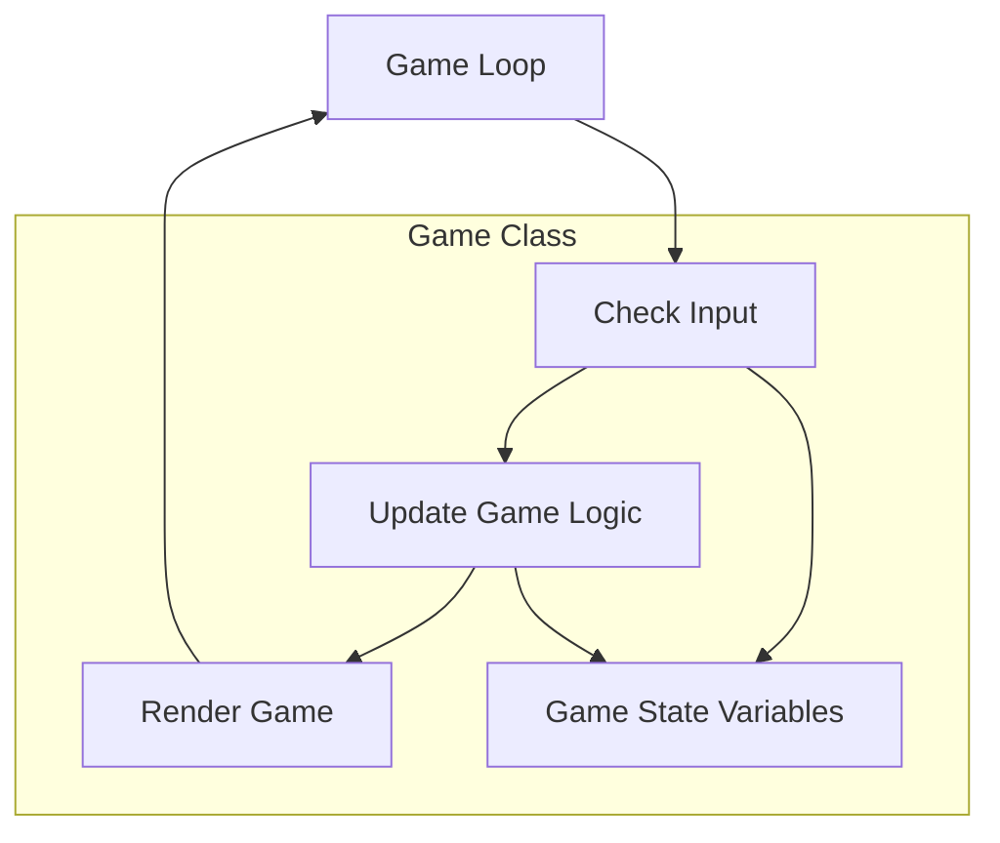
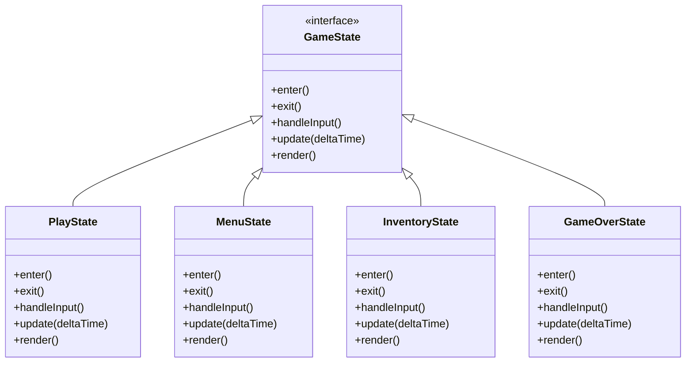
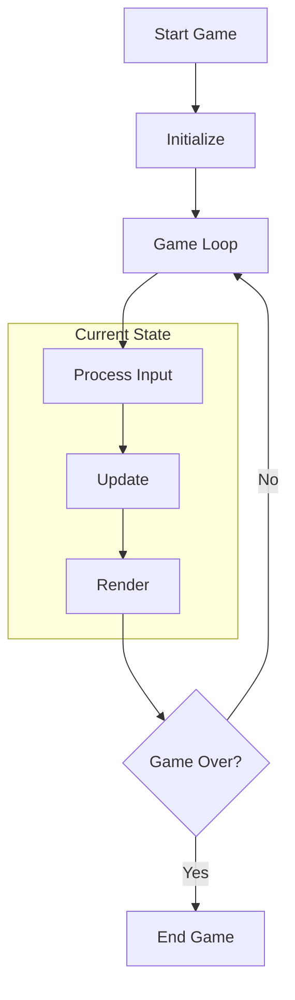
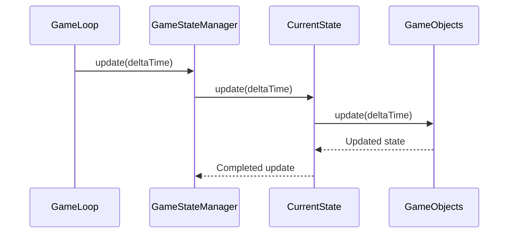
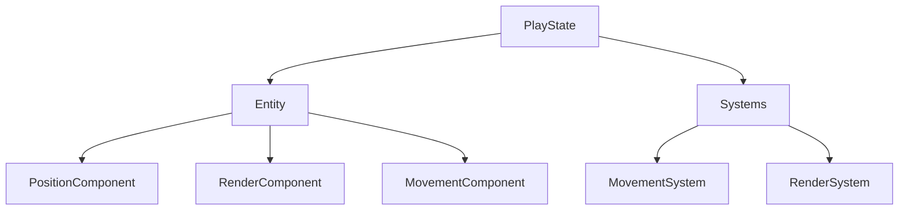
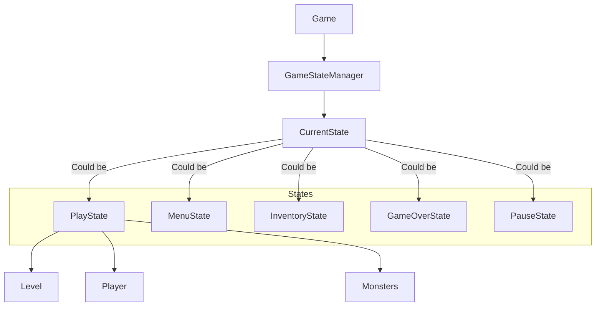
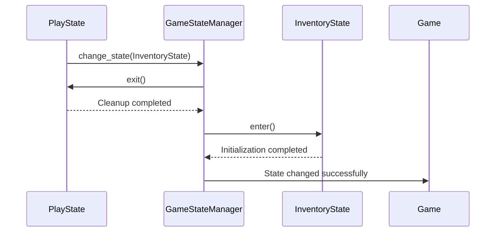
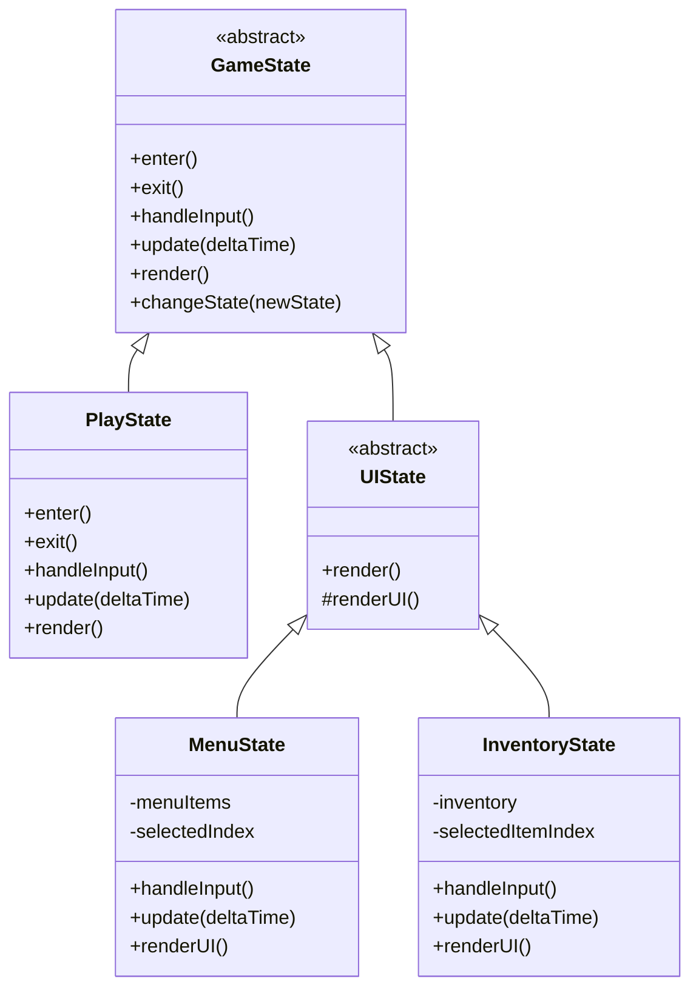

# Vanilla Roguelike: Game State Implementation Proposal

## Overview

This document analyzes the current state management approach in the Vanilla roguelike game and proposes improvements based on established Game Programming Patterns. The goal is to enhance maintainability, extensibility, and overall architecture quality while addressing current limitations.

## Table of Contents

1. [Current Implementation Analysis](#current-implementation-analysis)
2. [Relevant Game Programming Patterns](#relevant-game-programming-patterns)
3. [Proposed Architecture](#proposed-architecture)
4. [Implementation Details](#implementation-details)
5. [Benefits and Considerations](#benefits-and-considerations)
6. [Migration Strategy](#migration-strategy)

## Current Implementation Analysis

### Current Approach

The Vanilla roguelike currently manages game state largely within the central `Game` class, which handles everything from input processing to game logic to rendering. State transitions (such as moving between different game modes like playing, inventory management, and menus) are managed through conditional logic within the game loop.



### Current Limitations

1. **Tight Coupling**: Game modes and states are tightly integrated into the main game logic
2. **Code Sprawl**: State management code is scattered throughout the `Game` class
3. **State Transitions**: Transitions between states (menu, gameplay, inventory) are handled ad-hoc
4. **Testing Difficulty**: States are difficult to test in isolation
5. **Limited Extensibility**: Adding new game modes requires modifying core game loop logic

The current codebase contains state management code in various places:

```ruby
class Game
  def initialize
    # ...
    @in_menu = true
    @game_over = false
    @in_inventory = false
    # ...
  end

  def game_loop
    until @game_over
      # Process input based on current "state"
      if @in_menu
        process_menu_input
      elsif @in_inventory
        process_inventory_input
      else
        process_game_input
      end

      # Update
      # ...

      # Render based on current "state"
      if @in_menu
        render_menu
      elsif @in_inventory
        render_inventory
      else
        render_game
      end
    end
  end

  def process_menu_input
    # ...
  end

  def process_inventory_input
    # ...
  end

  # Many more methods...
end
```

This approach results in a monolithic `Game` class that's difficult to maintain and extend.

## Relevant Game Programming Patterns

To improve the state management, we can apply several established game programming patterns:

### 1. State Pattern

The State Pattern allows an object to alter its behavior when its internal state changes, appearing to change its class. This pattern is ideal for managing the different modes of the game.



### 2. Game Loop Pattern

While the game already uses a game loop, we can refine it to better interact with the State Pattern:



### 3. Update Method Pattern

Combined with the State Pattern, the Update Method Pattern allows each game state to encapsulate its own update logic:



### 4. Component Pattern

For entities within each state, we'll continue using the existing Entity Component System but with clearer boundaries between game states:



## Proposed Architecture

### Game State Manager

At the core of the proposed architecture is a `GameStateManager` that coordinates state transitions and delegates game loop operations to the current state:



### State Transitions

States can request transitions to other states, which the `GameStateManager` handles:



### State Hierarchy

For related states, we'll implement a state hierarchy to allow code reuse:



## Implementation Details

### Game State Interface

```ruby
module Vanilla
  module States
    class GameState
      attr_accessor :game

      def initialize(game)
        @game = game
      end

      def enter
        # Setup state - override in subclasses
      end

      def exit
        # Cleanup state - override in subclasses
      end

      def handle_input(input)
        # Process input - override in subclasses
        false # Return true if input was handled
      end

      def update(delta_time)
        # Update game logic - override in subclasses
      end

      def render
        # Render state - override in subclasses
      end

      protected

      def change_state(new_state)
        @game.state_manager.change_state(new_state)
      end

      def push_state(new_state)
        @game.state_manager.push_state(new_state)
      end

      def pop_state
        @game.state_manager.pop_state
      end
    end
  end
end
```

### Game State Manager

```ruby
module Vanilla
  class GameStateManager
    def initialize(game)
      @game = game
      @states = []
      @pending_state_change = nil
    end

    def current_state
      @states.last
    end

    def change_state(new_state)
      @pending_state_change = { type: :change, state: new_state }
    end

    def push_state(new_state)
      @pending_state_change = { type: :push, state: new_state }
    end

    def pop_state
      @pending_state_change = { type: :pop }
    end

    def handle_input(input)
      return false unless current_state
      current_state.handle_input(input)
    end

    def update(delta_time)
      process_pending_state_change if @pending_state_change

      return unless current_state
      current_state.update(delta_time)
    end

    def render
      return unless current_state
      current_state.render
    end

    private

    def process_pending_state_change
      case @pending_state_change[:type]
      when :change
        current_state&.exit
        @states.pop if @states.any?
        new_state = instantiate_state(@pending_state_change[:state])
        @states.push(new_state)
        new_state.enter
      when :push
        new_state = instantiate_state(@pending_state_change[:state])
        @states.push(new_state)
        new_state.enter
      when :pop
        current_state&.exit
        @states.pop if @states.any?
        current_state&.enter
      end

      @pending_state_change = nil
    end

    def instantiate_state(state_class)
      if state_class.is_a?(Class)
        state_class.new(@game)
      else
        state_class # Already instantiated
      end
    end
  end
end
```

### Refactored Game Class

```ruby
module Vanilla
  class Game
    attr_reader :state_manager, :renderer, :event_manager

    def initialize
      # ... existing initialization

      @state_manager = GameStateManager.new(self)

      # Start with menu state
      @state_manager.change_state(States::MenuState)
    end

    def start
      # ... initialization

      # Main game loop
      game_loop
    end

    private

    def game_loop
      last_time = Time.now

      loop do
        current_time = Time.now
        delta_time = current_time - last_time
        last_time = current_time

        # Process input
        input = @input_handler.get_input
        break if input == :quit

        # Handle input based on current state
        @state_manager.handle_input(input)

        # Update state
        @state_manager.update(delta_time)

        # Render current state
        @state_manager.render

        # Exit if no states remain
        break if @state_manager.current_state.nil?
      end

      cleanup
    end

    def cleanup
      # Cleanup resources
    end
  end
end
```

### Example States

#### Main Menu State

```ruby
module Vanilla
  module States
    class MenuState < GameState
      def initialize(game)
        super
        @menu_items = ["New Game", "Continue", "Options", "Quit"]
        @selected_index = 0
      end

      def enter
        # Setup menu music, etc.
      end

      def handle_input(input)
        case input
        when :up
          @selected_index = (@selected_index - 1) % @menu_items.size
          return true
        when :down
          @selected_index = (@selected_index + 1) % @menu_items.size
          return true
        when :select
          select_menu_item
          return true
        end

        false
      end

      def render
        # Draw menu background
        # Draw menu items, highlighting the selected one
      end

      private

      def select_menu_item
        case @menu_items[@selected_index]
        when "New Game"
          change_state(PlayState.new(@game, new_game: true))
        when "Continue"
          # Load saved game if available, otherwise show message
          if saved_game_exists?
            change_state(PlayState.new(@game, new_game: false))
          else
            # Show "No saved game" message
          end
        when "Options"
          push_state(OptionsState)
        when "Quit"
          # Signal game to quit
          @game.quit
        end
      end

      def saved_game_exists?
        # Check if save file exists
        false
      end
    end
  end
end
```

#### Play State

```ruby
module Vanilla
  module States
    class PlayState < GameState
      def initialize(game, new_game: true)
        super(game)
        @new_game = new_game
      end

      def enter
        if @new_game
          # Create a new level, player, etc.
          create_new_game
        else
          # Load saved game
          load_game
        end
      end

      def exit
        # Save game state if needed
        # Clean up resources
      end

      def handle_input(input)
        case input
        when :inventory
          push_state(InventoryState)
          return true
        when :pause
          push_state(PauseState)
          return true
        when :movement_keys
          # Handle player movement
          return true
        end

        false
      end

      def update(delta_time)
        # Update entities, systems
        @game.level.update(delta_time)

        # Check for game over condition
        if player_dead?
          change_state(GameOverState)
        end

        # Check if player reached stairs
        if player_at_stairs?
          next_level
        end
      end

      def render
        # Render level, entities, UI elements
        @game.renderer.render(@game.level)
        render_player_stats
      end

      private

      def create_new_game
        # Initialize a new game
        @game.level = Level.new(difficulty: 1)
        @game.player = create_player
        # ...
      end

      def load_game
        # Load game from save file
        # ...
      end

      def render_player_stats
        # Render health, etc.
      end

      def player_dead?
        # Check if player is dead
        false
      end

      def player_at_stairs?
        # Check if player is at stairs
        false
      end

      def next_level
        # Create next level and transition
        current_difficulty = @game.level.difficulty
        @game.level = Level.new(difficulty: current_difficulty + 1)
        # Transfer player to new level
      end
    end
  end
end
```

#### Inventory State

```ruby
module Vanilla
  module States
    class InventoryState < GameState
      def initialize(game)
        super
        @selected_index = 0
      end

      def enter
        @inventory = @game.player.get_component(InventoryComponent)
        # Setup inventory display
      end

      def handle_input(input)
        case input
        when :up
          @selected_index = (@selected_index - 1) % @inventory.items.size
          return true
        when :down
          @selected_index = (@selected_index + 1) % @inventory.items.size
          return true
        when :use
          use_selected_item
          return true
        when :drop
          drop_selected_item
          return true
        when :close
          pop_state
          return true
        end

        false
      end

      def render
        # Render the game world in the background
        @game.renderer.render(@game.level, dimmed: true)

        # Render inventory UI
        render_inventory_panel
      end

      private

      def render_inventory_panel
        # Draw inventory panel with items
      end

      def use_selected_item
        return if @inventory.items.empty?

        item = @inventory.items[@selected_index]
        # Use the item
        # Close inventory if appropriate
        pop_state if item.consumed?
      end

      def drop_selected_item
        return if @inventory.items.empty?

        item = @inventory.items.delete_at(@selected_index)
        # Drop item at player's position
      end
    end
  end
end
```

## Benefits and Considerations

### Advantages of the Proposed Approach

1. **Cleaner Separation of Concerns**: Each state encapsulates its own behavior
2. **Easier Maintenance**: Game states are isolated, making them easier to modify
3. **Improved Testability**: States can be tested independently
4. **Enhanced Extensibility**: New game states can be added without modifying existing code
5. **Reduced Complexity**: The main game class is simplified
6. **Stack-Based Navigation**: The state stack enables intuitive UI navigation (e.g., from game to inventory and back)
7. **Reusable Components**: Common state functionality can be shared through inheritance
8. **Predictable State Transitions**: State changes follow a consistent pattern

### Implementation Considerations

1. **Performance Impact**: The state pattern introduces some overhead from polymorphism and delegation
2. **Migration Complexity**: Refactoring from the current approach requires careful planning
3. **Learning Curve**: Developers unfamiliar with the State pattern may need time to adapt
4. **State Communication**: States need well-defined ways to share data
5. **Resource Management**: Resources may need to be loaded/unloaded during state transitions

## Migration Strategy

Transitioning from the current implementation to the proposed state-based architecture requires a phased approach:

### Phase 1: Create State Infrastructure

1. Implement the `GameState` base class
2. Implement the `GameStateManager`
3. Modify the `Game` class to use the state manager for core loop operations

### Phase 2: Extract Current States

1. Create initial state classes (MenuState, PlayState)
2. Move existing code from Game class to appropriate states
3. Test basic state transitions (menu to game and back)

### Phase 3: Implement Additional States

1. Add InventoryState, PauseState, GameOverState
2. Implement state-based UI navigation
3. Test all state transitions

### Phase 4: Refine and Optimize

1. Refactor common state functionality into base classes
2. Optimize resource loading/unloading between states
3. Add state transition animations if desired

## Conclusion

The proposed state-based architecture leverages established game programming patterns to significantly improve the Vanilla roguelike's code organization, maintainability, and extensibility. By encapsulating game states as distinct objects with well-defined responsibilities, the architecture provides a solid foundation for future enhancements while reducing the complexity of the core game code.

Implementation can proceed incrementally, allowing for continuous testing and validation throughout the migration process. The result will be a more robust, flexible game architecture that better supports ongoing development.