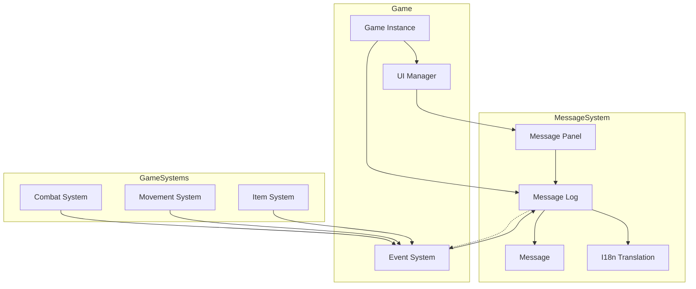
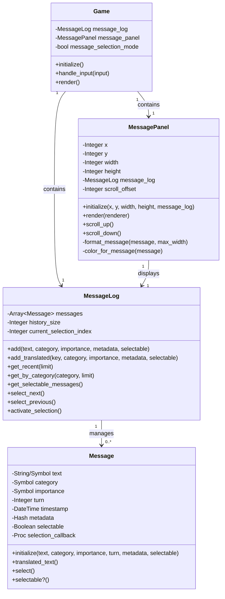
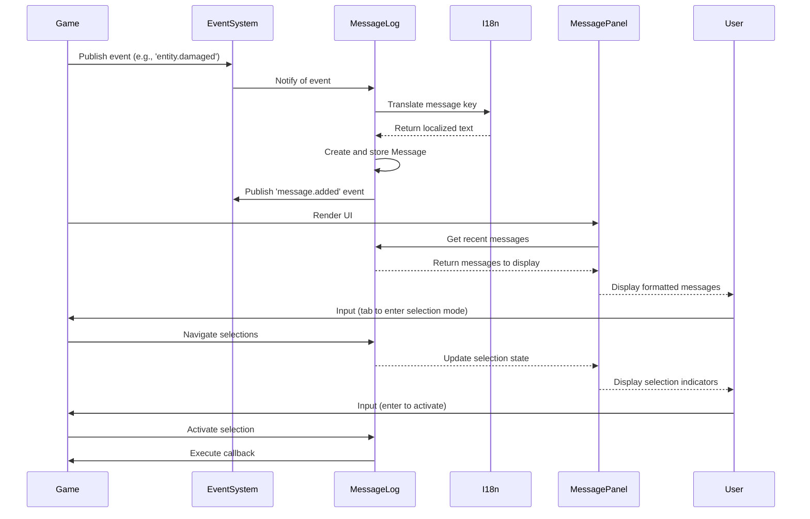

# Message System Implementation Plan

## Overview

This document outlines a concrete implementation plan for introducing a message system into Vanilla Roguelike. Building upon the previous proposal in `message_system_integration.md`, this plan focuses on practical implementation steps with an emphasis on:

1. **Localization**: Full integration with the I18n gem using existing locale structures
2. **UI Placement**: Positioning the message system underneath the map
3. **Interactivity**: Adding selectable message items for inventory and environment interactions
4. **Testing**: Comprehensive test coverage for the message system

## System Architecture



### Component Relationship Diagram



### Message Flow Diagram



## Visual Representation

### User Interface Layout

The message system will be positioned directly below the map view, providing immediate feedback to player actions.

```
+-------------------------------------------+
|                                           |
|                                           |
|                                           |
|                                           |
|             GAME MAP AREA                 |
|                                           |
|                                           |
|                                           |
|                                           |
+-------------------------------------------+
| You strike the goblin for 5 damage!       |
| The goblin misses you.                    |
| You find a healing potion.                |
| * Pick up the healing potion.             |
| You enter a dusty corridor.               |
+-------------------------------------------+
|           STATS/STATUS AREA               |
+-------------------------------------------+
```

### Message Examples

Below are examples of how various types of messages will appear to the player:

#### Regular Message Display
```
+-------------------------------------------+
| You strike the goblin for 5 damage!       | <- Combat message (white)
| The goblin is bleeding.                   | <- Status effect (white)
| You feel poison coursing through you!     | <- Warning message (yellow)
| You are critically wounded!               | <- Critical warning (red)
| You discover a hidden passage.            | <- Discovery message (green)
+-------------------------------------------+
```

#### Selectable Messages
```
+-------------------------------------------+
| You discover a chest. What do you do?     |
| * Open the chest                          | <- Selectable option
| * Examine the chest for traps             | <- Selectable option
| * Leave it alone                          | <- Selectable option
| You hear scratching noises from within.   |
+-------------------------------------------+
```

#### Message Selection Mode
```
+-------------------------------------------+
| You find several items on the ground:     |
| * Pick up the healing potion              |
| > Pick up the rusty sword                 | <- Currently selected (blue highlight)
| * Pick up the gold coins (37)             |
| * Pick up all items                       |
+-------------------------------------------+
```

#### Scrolling Indicator
```
+-------------------------------------------+
| [▲ More messages above]                   | <- Scroll indicator
| The skeleton crumbles to dust.            |
| You gain 25 experience points.            |
| Level up! You are now level 3.            |
| [▼ More messages below]                   | <- Scroll indicator
+-------------------------------------------+
```

#### Inventory Interaction via Messages
```
+-------------------------------------------+
| You check your inventory:                 |
| > Healing Potion (3)                      | <- Selected item
|   ↪ Use                                   | <- Sub-action
|   ↪ Examine                               | <- Sub-action
|   ↪ Drop                                  | <- Sub-action
+-------------------------------------------+
```

## Terminal Selection Mechanisms

Since we're implementing this system in a terminal environment, we need specialized input mechanisms that work well without mouse interaction and don't conflict with basic movement controls (WASD, HJKL, arrow keys). We'll implement two complementary approaches:

### 1. Keyboard Shortcut Labels

For immediate, direct selection of options without entering a special mode:

```
+-------------------------------------------+
| You discover a chest. What do you do?     |
| o) Open the chest                         | <- Press 'o' to select
| e) Examine the chest for traps            | <- Press 'e' to select
| l) Leave it alone                         | <- Press 'l' to select
| You hear scratching noises from within.   |
+-------------------------------------------+
```

This approach:
- Provides immediate, single-keystroke access to options
- Preserves movement keys for character control
- Makes selection visible and intuitive
- Works well for limited numbers of options (can use a-z keys)

Implementation details:
- Each `Message` will have an optional `shortcut_key` property
- The system will automatically assign unused keys when creating selectable messages
- Shortcut keys will be displayed before the option text
- Key handling will check for these shortcuts without interfering with movement

### 2. Mode Switching

For more complex interaction patterns and when many options are available:

```
+-------------------------------------------+
| [MESSAGE SELECTION MODE]                  | <- Mode indicator
| You find several items on the ground:     |
| * Pick up the healing potion              |
| > Pick up the rusty sword                 | <- Selected with arrow keys
| * Pick up the gold coins (37)             |
| * Pick up all items                       |
+-------------------------------------------+
```

This approach:
- Handles situations with many options or nested selections
- Allows arrow keys to navigate through messages rather than move the character
- Provides clear visual feedback about the current mode
- Supports more complex interaction patterns (nesting, scrolling)

Implementation details:
- Toggle between movement mode and message selection mode with Tab key
- Clear visual indicators show the current mode
- In selection mode, movement keys navigate messages
- Mode switching doesn't consume a game turn
- Message selection is only committed when Enter is pressed

### Combined Example: Inventory Management

Both approaches can be used together, with shortcuts for common actions and mode-based selection for complex interactions:

```
+-------------------------------------------+
| [MESSAGE SELECTION MODE]                  |
| Your inventory contains:                  |
| i) Iron Sword                             | <- Press 'i' to select directly
| > p) Health Potion (3)                    | <- Currently selected with arrows
| g) Gold (37)                              |
+-------------------------------------------+
```

When an item is selected, sub-actions appear:

```
+-------------------------------------------+
| [MESSAGE SELECTION MODE]                  |
| > p) Health Potion (3)                    | <- Selected item
|     u) Use                                | <- Sub-action shortcut
|     x) Examine                            | <- Sub-action shortcut
|     d) Drop                               | <- Sub-action shortcut
+-------------------------------------------+
```

### Implementation Details

#### Message Class Enhancements

```ruby
class Message
  attr_reader :text, :category, :importance, :turn, :timestamp, :metadata
  attr_accessor :selectable, :selection_callback, :shortcut_key

  def initialize(text, category: :system, importance: :normal,
                turn: nil, metadata: {}, selectable: false,
                shortcut_key: nil, &selection_callback)
    @text = text
    @category = category
    @importance = importance
    @turn = turn || Vanilla.game&.current_turn || 0
    @timestamp = Time.now
    @metadata = metadata
    @selectable = selectable
    @shortcut_key = shortcut_key
    @selection_callback = selection_callback if block_given?
  end

  # ... existing methods ...

  def has_shortcut?
    !@shortcut_key.nil?
  end
end
```

#### Auto-assigning Shortcut Keys

```ruby
class MessageLog
  # ... existing code ...

  def add_selectable_options(options)
    used_keys = []

    options.each do |option_text, callback|
      # Generate shortcut key from first letter if available
      first_letter = option_text.downcase.chars.first
      shortcut = if !used_keys.include?(first_letter) && ('a'..'z').include?(first_letter)
                   first_letter
                 else
                   # Find unused key
                   ('a'..'z').find { |k| !used_keys.include?(k) }
                 end

      used_keys << shortcut

      add(option_text,
          category: :option,
          selectable: true,
          shortcut_key: shortcut,
          &callback)
    end
  end

  # Example usage:
  # message_log.add_selectable_options({
  #   "Open the chest" => -> { game.open_chest(chest) },
  #   "Examine the chest" => -> { game.examine_chest(chest) },
  #   "Leave it alone" => -> { /* do nothing */ }
  # })
end
```

#### Enhanced Rendering for Shortcuts

```ruby
class MessagePanel
  # ... existing code ...

  def render(renderer)
    messages = @message_log.get_recent(@height + @scroll_offset)
    visible_messages = messages[@scroll_offset, @height]

    # Show mode indicator if in selection mode
    if @game.message_selection_mode
      renderer.draw_text(@x, @y - 1, "[MESSAGE SELECTION MODE]", :cyan)
    end

    visible_messages.each_with_index do |message, idx|
      y_pos = @y + idx
      text = format_message(message, @width)
      color = color_for_message(message)

      # Render shortcuts and selection indicators
      if message.selectable?
        if message.has_shortcut?
          # Show shortcut key format: "k) Message text"
          shortcut_text = "#{message.shortcut_key}) "
          renderer.draw_text(@x, y_pos, shortcut_text, :cyan)

          # Check if selected in selection mode
          selectable_messages = @message_log.get_selectable_messages
          is_selected = @game.message_selection_mode &&
                        !@message_log.current_selection_index.nil? &&
                        selectable_messages[@message_log.current_selection_index] == message

          # Draw the message text (with selection highlight if needed)
          x_offset = @x + shortcut_text.length
          renderer.draw_text(x_offset, y_pos, text, is_selected ? :white_on_blue : color)
        else
          # Legacy format with asterisk/arrow
          indicator = @game.message_selection_mode && is_selected ? ">" : "*"
          renderer.draw_text(@x, y_pos, indicator, :cyan)
          renderer.draw_text(@x + 2, y_pos, text, is_selected ? :white_on_blue : color)
        end
      else
        renderer.draw_text(@x, y_pos, text, color)
      end
    end

    # Show control hints if in selection mode
    if @game.message_selection_mode
      hint_text = "[Tab] Exit | [Enter] Select"
      renderer.draw_text(@x, @y + @height, hint_text, :cyan)
    end
  end
end
```

#### Updated Input Handling

```ruby
class Game
  # ... existing code ...

  def handle_input(input)
    # First check if we're in message selection mode
    if @message_selection_mode
      case input
      when :up, :k
        @message_log.select_previous
        return true
      when :down, :j
        @message_log.select_next
        return true
      when :enter
        @message_log.activate_selection
        return true
      when :tab, :escape
        @message_selection_mode = false
        return true
      end

      # No turn consumed for selection navigation
      return true
    end

    # Check for shortcut keys when not in selection mode
    selectable_messages = @message_log.get_selectable_messages
    shortcut_message = selectable_messages.find { |m| m.has_shortcut? && m.shortcut_key == input.to_s }
    if shortcut_message
      shortcut_message.select
      return true
    end

    # Toggle into message selection mode
    if input == :tab && !selectable_messages.empty?
      @message_selection_mode = true
      return true
    end

    # Process regular game input if not handled by message system
    case input
    when :up, :w, :k
      move_player(0, -1)
    when :down, :s, :j
      move_player(0, 1)
    when :left, :a, :h
      move_player(-1, 0)
    when :right, :d, :l
      move_player(1, 0)
    # ... other input handling
    end
  end
end
```

### Visual Examples of Mode Transitions

#### 1. Normal Mode (Movement)
```
+-------------------------------------------+
|                                           |
|                                           |
|              @ (player)                   |
|                                           |
|             GAME MAP AREA                 |
|                                           |
|                                           |
|                                           |
|                                           |
+-------------------------------------------+
| You find a chest.                         |
| o) Open the chest                         |
| e) Examine the chest for traps            |
| l) Leave it alone                         |
| You hear scratching noises from within.   |
+-------------------------------------------+
| [Tab] Enter selection mode                |
+-------------------------------------------+
```

#### 2. After Pressing Tab (Selection Mode)
```
+-------------------------------------------+
|                                           |
|                                           |
|              @ (player)                   |
|                                           |
|             GAME MAP AREA                 |
|                                           |
|                                           |
|                                           |
|                                           |
+-------------------------------------------+
| [MESSAGE SELECTION MODE]                  |
| You find a chest.                         |
| > o) Open the chest                       | <- First option selected
| e) Examine the chest for traps            |
| l) Leave it alone                         |
| You hear scratching noises from within.   |
+-------------------------------------------+
| [Tab] Exit | [↑/↓] Navigate | [Enter] Select |
+-------------------------------------------+
```

#### 3. After Pressing Down Arrow (Still in Selection Mode)
```
+-------------------------------------------+
|                                           |
|                                           |
|              @ (player)                   |
|                                           |
|             GAME MAP AREA                 |
|                                           |
|                                           |
|                                           |
|                                           |
+-------------------------------------------+
| [MESSAGE SELECTION MODE]                  |
| You find a chest.                         |
| o) Open the chest                         |
| > e) Examine the chest for traps          | <- Second option selected
| l) Leave it alone                         |
| You hear scratching noises from within.   |
+-------------------------------------------+
| [Tab] Exit | [↑/↓] Navigate | [Enter] Select |
+-------------------------------------------+
```

### Multilevel Selection with Nested Options

```
+-------------------------------------------+
| [MESSAGE SELECTION MODE]                  |
| You check your inventory:                 |
| > p) Health Potion (3)                    | <- Selected item
|     u) Use                                | <- Nested option
|     x) Examine                            | <- Nested option
|     d) Drop                               | <- Nested option
| s) Rusty Sword                            |
| a) Leather Armor                          |
+-------------------------------------------+
| [Tab] Exit | [↑/↓] Navigate | [Enter] Select |
+-------------------------------------------+
```

The implementation of these terminal selection mechanisms will provide intuitive, keyboard-friendly interaction with the message system while maintaining clean separation between movement controls and message interaction.

## Implementation Phases

### Phase 1: Core Message System Foundation (1-2 days)

#### 1.1 Create Base Classes
- Implement `MessageLog` class to store and manage messages
- Create `Message` class to represent individual messages with properties:
  - Text content
  - Category (:combat, :item, :system, etc.)
  - Importance level
  - Turn number
  - Selection metadata

#### 1.2 I18n Integration
- Connect message system to the existing I18n infrastructure
- Create message helper methods for translation lookups
- Add missing message keys to locale files if needed

#### 1.3 Basic Tests
- Unit tests for message creation, storage, and retrieval
- Test I18n integration and fallbacks

### Phase 2: UI Components and Rendering (2-3 days)

#### 2.1 Message Panel Component
- Create `MessagePanel` UI component
- Position it below the map area
- Implement basic message display with scrolling capability

#### 2.2 Message Formatting
- Implement styled rendering based on message importance
- Add category-based coloring and visual indicators
- Create message truncation and wrapping for panel dimensions

#### 2.3 Selection System
- Add selection state tracking in `MessagePanel`
- Implement selection indicator rendering
- Create keyboard navigation within messages

#### 2.4 Integration Tests
- Test message rendering in different viewport sizes
- Test scrolling behavior
- Test selection navigation

### Phase 3: Game Integration and Event System (2-3 days)

#### 3.1 Event to Message Translation
- Connect to existing event system
- Translate game events into appropriate localized messages
- Implement message publishing for various game systems (combat, movement, items)

#### 3.2 Message History Management
- Implement message history with pagination
- Add turn-based message filtering
- Create category-based message filtering

#### 3.3 Integration Tests
- Test event to message translation
- Test history management
- Test filtering capabilities

### Phase 4: Interactive Message Features (2-3 days)

#### 4.1 Selectable Item Implementation
- Add message metadata for selectable items
- Implement item selection callback system
- Create visual indicators for selectable messages

#### 4.2 Interaction System
- Add keyboard/input handlers for message interaction
- Implement action dispatching from message selection
- Create context-sensitive message interactions

#### 4.3 Integration with Inventory
- Link selectable messages to inventory items
- Implement inventory action dispatching

#### 4.4 Comprehensive Testing
- Test selection and interaction system
- Test inventory integration
- Test edge cases and error handling

## Technical Design

### Message Class Structure

```ruby
class Message
  attr_reader :text, :category, :importance, :turn, :timestamp, :metadata
  attr_accessor :selectable, :selection_callback

  def initialize(text, category: :system, importance: :normal,
                turn: nil, metadata: {}, selectable: false, &selection_callback)
    @text = text
    @category = category
    @importance = importance
    @turn = turn || Vanilla.game&.current_turn || 0
    @timestamp = Time.now
    @metadata = metadata
    @selectable = selectable
    @selection_callback = selection_callback if block_given?
  end

  def selectable?
    @selectable
  end

  def select
    @selection_callback&.call(self) if @selectable
  end

  def translated_text
    return @text unless @text.is_a?(Symbol)

    # Handle translation with interpolation values from metadata
    I18n.t(@text, **@metadata)
  end
end
```

### MessageLog Implementation

```ruby
class MessageLog
  attr_reader :messages, :history_size, :current_selection_index

  DEFAULT_CATEGORIES = [:system, :combat, :movement, :item, :story, :debug]

  def initialize(history_size: 100)
    @messages = []
    @history_size = history_size
    @current_selection_index = nil
    @event_manager = Vanilla.event_manager

    # Register event listeners
    register_event_listeners
  end

  def add(text_or_key, category: :system, importance: :normal, metadata: {}, selectable: false, &block)
    # Handle both direct text and translation keys
    message = Message.new(
      text_or_key,
      category: category,
      importance: importance,
      metadata: metadata,
      selectable: selectable,
      &block
    )

    @messages.unshift(message)
    @messages.pop if @messages.size > @history_size

    # Publish message added event
    @event_manager.publish('message.added', message: message)

    message
  end

  def add_translated(key, category: :system, importance: :normal, metadata: {}, selectable: false, &block)
    add(key, category: category, importance: importance, metadata: metadata, selectable: selectable, &block)
  end

  def get_by_category(category, limit = 10)
    @messages.select { |m| m.category == category }.take(limit)
  end

  def get_recent(limit = 10)
    @messages.take(limit)
  end

  def get_selectable_messages
    @messages.select(&:selectable?)
  end

  def select_next
    selectable = get_selectable_messages
    return if selectable.empty?

    if @current_selection_index.nil?
      @current_selection_index = 0
    else
      @current_selection_index = (@current_selection_index + 1) % selectable.size
    end
  end

  def select_previous
    selectable = get_selectable_messages
    return if selectable.empty?

    if @current_selection_index.nil?
      @current_selection_index = selectable.size - 1
    else
      @current_selection_index = (@current_selection_index - 1) % selectable.size
    end
  end

  def activate_selection
    selectable = get_selectable_messages
    return if selectable.empty? || @current_selection_index.nil?

    selectable[@current_selection_index].select
  end

  private

  def register_event_listeners
    # Register for events that should generate messages
    @event_manager.subscribe('entity.damaged', method(:handle_entity_damaged))
    @event_manager.subscribe('entity.moved', method(:handle_entity_moved))
    @event_manager.subscribe('item.picked_up', method(:handle_item_picked_up))
    # ... more event subscriptions
  end

  def handle_entity_damaged(event)
    entity = event.payload[:entity]
    amount = event.payload[:amount]
    attacker = event.payload[:attacker]

    if entity.player?
      add_translated(:enemy_hit,
        category: :combat,
        importance: :warning,
        metadata: { enemy: attacker.name, damage: amount }
      )
    elsif attacker&.player?
      add_translated(:player_hit,
        category: :combat,
        metadata: { enemy: entity.name, damage: amount }
      )
    end
  end

  def handle_entity_moved(event)
    # Implement movement message handling
  end

  def handle_item_picked_up(event)
    # Implement item pickup message handling with selectable item
  end
end
```

### MessagePanel UI Component

```ruby
class MessagePanel
  attr_reader :x, :y, :width, :height, :message_log

  def initialize(x, y, width, height, message_log)
    @x = x
    @y = y
    @width = width
    @height = height
    @message_log = message_log
    @scroll_offset = 0
  end

  def render(renderer)
    messages = @message_log.get_recent(@height + @scroll_offset)
    visible_messages = messages[@scroll_offset, @height]

    visible_messages.each_with_index do |message, idx|
      y_pos = @y + idx
      text = format_message(message, @width)
      color = color_for_message(message)

      # Check if this message is selected
      selectable_messages = @message_log.get_selectable_messages
      is_selected = !@message_log.current_selection_index.nil? &&
                    selectable_messages[@message_log.current_selection_index] == message

      # Render selection indicator
      if message.selectable?
        indicator = is_selected ? ">" : "*"
        renderer.draw_text(@x, y_pos, indicator, :cyan)
        renderer.draw_text(@x + 2, y_pos, text, is_selected ? :white_on_blue : color)
      else
        renderer.draw_text(@x, y_pos, text, color)
      end
    end

    # Render scrollbar if needed
    render_scrollbar(renderer) if @message_log.messages.size > @height
  end

  def scroll_up
    @scroll_offset = [@scroll_offset - 1, 0].max
  end

  def scroll_down
    max_scroll = [@message_log.messages.size - @height, 0].max
    @scroll_offset = [@scroll_offset + 1, max_scroll].min
  end

  private

  def format_message(message, max_width)
    text = message.translated_text.to_s
    # Truncate to fit panel width
    text.length > max_width ? text[0...(max_width-3)] + "..." : text
  end

  def color_for_message(message)
    case message.importance
    when :critical
      :red
    when :warning
      :yellow
    when :success
      :green
    else
      :white
    end
  end

  def render_scrollbar(renderer)
    # Scrollbar implementation
  end
end
```

## In-Game Scenarios & Message Flow Examples

### Combat Scenario

When a player attacks an enemy, the message flow would be:

1. Player presses attack button/key
2. Combat system processes attack and determines damage
3. Event `entity.damaged` is published
4. MessageLog receives the event and creates a localized message
5. Message is displayed in the panel below the map

```
Player attacks goblin -> Event System -> Message Log -> UI Panel
+-------------------------------------------+
| You strike the goblin for 7 damage!       | <- New message appears
| The goblin looks wounded.                 |
| You hear a noise from the north corridor. |
+-------------------------------------------+
```

When the player takes damage:

```
Goblin attacks player -> Event System -> Message Log -> UI Panel
+-------------------------------------------+
| The goblin hits you for 3 damage!         | <- Warning importance (yellow)
| You strike the goblin for 7 damage!       |
| The goblin looks wounded.                 |
+-------------------------------------------+
```

### Item Discovery & Interaction

When a player finds an item:

```
Player moves onto item -> Event System -> Message Log -> UI Panel
+-------------------------------------------+
| You find a healing potion.                |
| * Pick up the healing potion              | <- Selectable message
| You hear rustling in the shadows.         |
+-------------------------------------------+
```

When the player enters selection mode (with Tab key):

```
Player presses Tab -> Game enters selection mode
+-------------------------------------------+
| You find a healing potion.                |
| > Pick up the healing potion              | <- Selected message (blue highlight)
| You hear rustling in the shadows.         |
+-------------------------------------------+
```

When the player activates the selection (with Enter key):

```
Player presses Enter -> Selection callback triggered
+-------------------------------------------+
| You pick up the healing potion.           | <- New message appears
| You find a healing potion.                |
| > Pick up the healing potion              |
+-------------------------------------------+
```

### Contextual Inventory Actions

When a player examines inventory through messages:

```
Player checks inventory -> System creates selectable messages
+-------------------------------------------+
| Your inventory contains:                  |
| * Healing Potion (3)                      | <- Selectable
| * Rusty Sword                             | <- Selectable
| * Iron Shield                             | <- Selectable
+-------------------------------------------+
```

When selecting an item:

```
Player selects item -> Expanded options appear
+-------------------------------------------+
| Your inventory contains:                  |
| > Healing Potion (3)                      | <- Selected
|   ↪ Use                                   | <- Sub-option becomes selectable
|   ↪ Examine                               | <- Sub-option becomes selectable
|   ↪ Drop                                  | <- Sub-option becomes selectable
+-------------------------------------------+
```

### Multilevel Selection Example

For complex interactions like using an item on a target:

```
Player chooses "Use" -> Target selection appears
+-------------------------------------------+
| Choose a target for Healing Potion:       |
| > Use on yourself                         | <- Selected option
| * Use on wounded ally                     | <- Selectable option
+-------------------------------------------+
```

### Continuous Narrative

For story elements or environmental descriptions:

```
Player enters new area -> System adds descriptive messages
+-------------------------------------------+
| You enter the ancient crypt.              | <- Story category (blue)
| The air is thick with dust and the smell  |
| of decay. Faded inscriptions cover the    |
| walls, telling tales of forgotten kings.  |
+-------------------------------------------+
```

## Integration with Game Class

```ruby
# In Game class
def initialize
  # Existing initialization...

  # Initialize message log
  @message_log = MessageLog.new

  # Create message panel below the map
  @message_panel = MessagePanel.new(
    0,                   # x position
    @map_height,         # y position (just below the map)
    @screen_width,       # full width
    5,                   # height in lines
    @message_log
  )

  # Add to UI components
  @ui_components << @message_panel
end

def start
  # Welcome message
  @message_log.add_translated(:welcome, category: :system, importance: :success)

  # Existing start logic...
end

def handle_input(input)
  # Existing input handling...

  # Message panel navigation/selection
  case input
  when :up
    # If in message selection mode
    if @message_selection_mode
      @message_log.select_previous
      return true
    end
  when :down
    if @message_selection_mode
      @message_log.select_next
      return true
    end
  when :enter
    if @message_selection_mode
      @message_log.activate_selection
      return true
    end
  when :tab
    # Toggle message selection mode
    @message_selection_mode = !@message_selection_mode
    return true
  end

  false
end
```

## Testing Strategy

### Unit Tests

```ruby
RSpec.describe Message do
  describe "#initialize" do
    it "creates a message with default values" do
      message = Message.new("Test message")
      expect(message.text).to eq("Test message")
      expect(message.category).to eq(:system)
      expect(message.importance).to eq(:normal)
      expect(message.selectable).to eq(false)
    end

    it "handles translation keys" do
      I18n.backend.store_translations(:en, { test_key: "Translated message" })
      message = Message.new(:test_key)
      expect(message.translated_text).to eq("Translated message")
    end

    it "handles interpolation in translations" do
      I18n.backend.store_translations(:en, { with_param: "Found %{item}" })
      message = Message.new(:with_param, metadata: { item: "sword" })
      expect(message.translated_text).to eq("Found sword")
    end
  end

  describe "#select" do
    it "calls the selection callback when selected" do
      callback_called = false
      message = Message.new("Selectable", selectable: true) { callback_called = true }
      message.select
      expect(callback_called).to be true
    end

    it "does nothing when not selectable" do
      callback_called = false
      message = Message.new("Not selectable") { callback_called = true }
      message.select
      expect(callback_called).to be false
    end
  end
end

RSpec.describe MessageLog do
  let(:message_log) { MessageLog.new }

  describe "#add" do
    it "adds messages to the log" do
      message = message_log.add("Test message")
      expect(message_log.messages.first).to eq(message)
    end

    it "limits the history size" do
      message_log = MessageLog.new(history_size: 2)
      message1 = message_log.add("Message 1")
      message2 = message_log.add("Message 2")
      message3 = message_log.add("Message 3")

      expect(message_log.messages.size).to eq(2)
      expect(message_log.messages).to include(message2)
      expect(message_log.messages).to include(message3)
      expect(message_log.messages).not_to include(message1)
    end
  end

  describe "selection navigation" do
    before do
      message_log.add("Regular message")
      message_log.add("Selectable 1", selectable: true)
      message_log.add("Selectable 2", selectable: true)
    end

    it "navigates through selectable messages" do
      expect(message_log.current_selection_index).to be_nil

      message_log.select_next
      expect(message_log.current_selection_index).to eq(0)

      message_log.select_next
      expect(message_log.current_selection_index).to eq(1)

      message_log.select_next
      expect(message_log.current_selection_index).to eq(0) # Wraps around

      message_log.select_previous
      expect(message_log.current_selection_index).to eq(1)
    end
  end
end
```

### Integration Tests

```ruby
RSpec.describe "Message System Integration" do
  let(:game) { Game.new }

  before do
    # Setup game instance
  end

  it "displays messages when game events occur" do
    # Trigger a combat event
    player = game.player
    enemy = game.entities.find { |e| e.is_a?(Enemy) }
    game.combat_system.attack(player, enemy, damage: 5)

    # Check that a message was added
    expect(game.message_log.messages.first.category).to eq(:combat)
    expect(game.message_log.messages.first.translated_text).to include("5 damage")
  end

  it "displays item pickup messages with selectable options" do
    # Create an item and have player pick it up
    item = Item.new("Health Potion")
    game.item_system.pickup(game.player, item)

    # Check that a selectable message was added
    latest_message = game.message_log.messages.first
    expect(latest_message.category).to eq(:item)
    expect(latest_message.selectable).to be true
  end

  it "activates items through message selection" do
    # Create an item and have player pick it up
    item = Item.new("Health Potion")
    was_used = false
    allow(item).to receive(:use) { was_used = true }

    game.item_system.pickup(game.player, item)

    # Select and activate the message
    game.message_log.select_next
    game.message_log.activate_selection

    expect(was_used).to be true
  end
end
```

## Localization Strategy

### Message Key Structure

We'll organize localization keys to match game domains:

```yaml
# config/locales/en.yml
en:
  # Existing keys from the current structure
  game:
    welcome: "Welcome to Vanilla, brave adventurer! Your journey begins..."
    # ...

  combat:
    player_hit: "You strike the %{enemy} for %{damage} damage!"
    # ...

  # New keys for message system
  messages:
    history_cleared: "Message history cleared."
    selection_mode:
      enter: "Entered message selection mode. Use up/down to navigate."
      exit: "Exited message selection mode."

  ui:
    message_panel:
      scroll_indicator: "More messages above/below"
      no_messages: "No messages to display."
```

### Example Translations for Key Game Scenarios

```yaml
en:
  # Combat messages
  combat:
    player_hit: "You strike the %{enemy} for %{damage} damage!"
    player_miss: "You swing at the %{enemy} but miss!"
    enemy_hit: "The %{enemy} hits you for %{damage} damage!"
    enemy_miss: "The %{enemy} lunges at you but misses!"
    critical_hit: "Critical hit! You deal %{damage} damage to the %{enemy}!"

  # Item interactions
  items:
    found: "You find %{item_name}."
    pickup: "You pick up the %{item_name}."
    pickup_option: "Pick up the %{item_name}"
    examine_option: "Examine the %{item_name}"
    use_option: "Use the %{item_name}"
    equip_option: "Equip the %{item_name}"

  # Environmental descriptions
  environment:
    enter_room: "You enter a %{room_description} room."
    discover_secret: "You discover a hidden %{discovery}!"

  # Status effects
    status:
    poisoned: "You feel poison coursing through your veins!"
    bleeding: "You are bleeding! You lose %{damage} health."
    healing: "The healing potion restores %{amount} health."
```

### I18n Usage

```ruby
# Direct usage in code
message_log.add_translated('combat.player_hit',
  category: :combat,
  metadata: { enemy: 'goblin', damage: 5 }
)

# Support for both symbol and string keys
message_log.add(:combat.player_hit, ...)
message_log.add('combat.player_hit', ...)
```

## Timeline and Milestones

1. **Week 1**: Phase 1 (Core) and Phase 2 (UI)
   - Day 1-2: Implement MessageLog and Message classes with tests
   - Day 3-4: Create MessagePanel UI component
   - Day 5: Complete I18n integration

2. **Week 2**: Phase 3 (Game Integration) and Phase 4 (Interactive Features)
   - Day 6-7: Complete event system integration
   - Day 8-9: Implement selectable items and interaction
   - Day 10: Finalize testing and documentation

## Conclusion

This implementation plan provides a structured approach to adding a fully-featured message system to Vanilla Roguelike. The system is designed with future extensibility in mind, particularly for inventory management and environment interactions. By leveraging the existing I18n framework and following a test-driven development approach, we can ensure a robust and maintainable addition to the game.

Key features of this implementation include:
- Full localization support
- Selectable message items
- Message categorization and filtering
- Visual positioning below the map
- Comprehensive test coverage
- Integration with existing game systems

Upon approval of this plan, implementation can begin with the core Message and MessageLog classes, followed by the UI components and game integration.