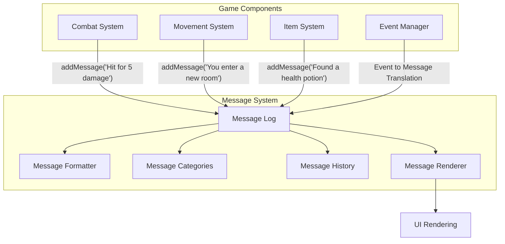
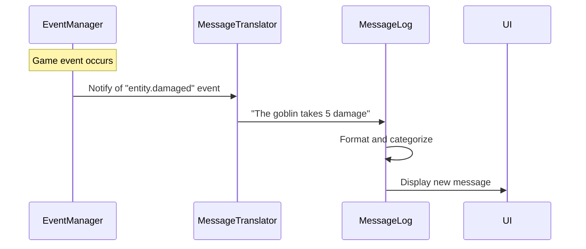
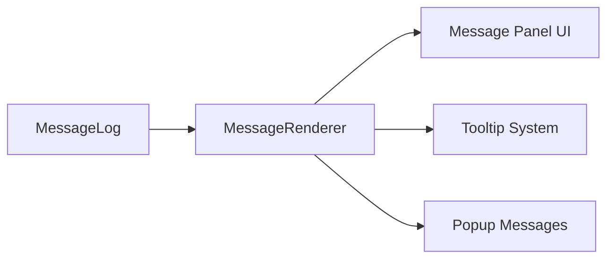

# Vanilla Roguelike: Message System Integration

## Overview

This document outlines a comprehensive message system for the Vanilla roguelike game. While the existing event system provides a foundation for communication between components, a dedicated message system can enhance in-game communication, player feedback, and narrative elements. This proposal details how to implement and integrate a message system with the current codebase.

## Table of Contents

1. [Message System Purpose](#message-system-purpose)
2. [Architecture Overview](#architecture-overview)
3. [Integration with Existing Systems](#integration-with-existing-systems)
4. [Implementation Details](#implementation-details)
5. [Examples and Use Cases](#examples-and-use-cases)
6. [Future Extensions](#future-extensions)

## Message System Purpose

The message system serves several key functions:

1. **Player Feedback**: Communicate game events to the player (combat results, discoveries, status changes)
2. **Narrative Elements**: Deliver story components, environmental descriptions, and lore
3. **Tutorial Guidance**: Provide contextual help and instruction for new players
4. **Game History**: Maintain a record of significant events for the player to review
5. **Debugging**: Assist developers in tracking game flow and diagnosing issues

Unlike the event system, which primarily facilitates internal communication between game components, the message system focuses on human-readable outputs and game-to-player communication.

## Architecture Overview

The proposed message system follows a centralized aggregator pattern with categorized messages and formatting capabilities:



## Integration with Existing Systems

The message system will integrate with the existing architecture in several ways:

### 1. Connection with Event System

The message system will subscribe to the event manager to translate relevant game events into player messages:



### 2. Direct API Access

Game systems can also add messages directly through a simple API:

```ruby
# Example from a combat system
message_log.add("You strike the goblin for 5 damage", :combat)
message_log.add("The goblin is bleeding", :status, :warning)
```

### 3. UI Integration

The message system will provide rendering components to display messages in the game UI:



## Implementation Details

### Core Message Log Class

```ruby
module Vanilla
  class MessageLog
    attr_reader :messages, :history_size

    DEFAULT_CATEGORIES = [:system, :combat, :movement, :item, :story, :debug]

    def initialize(history_size: 100)
      @messages = []
      @history_size = history_size
      @event_manager = Vanilla.event_manager
      @formatters = {}

      # Register with event manager for relevant events
      register_event_listeners

      # Initialize default formatters
      register_default_formatters
    end

    def add(text, category = :system, importance = :normal, metadata = {})
      timestamp = Time.now
      message = {
        text: text,
        category: category,
        importance: importance,
        timestamp: timestamp,
        turn: Vanilla.game&.current_turn || 0,
        metadata: metadata
      }

      # Apply formatters
      message = apply_formatters(message)

      # Add to message list
      @messages.unshift(message)

      # Trim history if needed
      @messages.pop if @messages.size > @history_size

      # Publish a message event that UI can listen for
      @event_manager.publish('message.added', message: message)

      message
    end

    def get_by_category(category, limit = 10)
      @messages.select { |m| m[:category] == category }.take(limit)
    end

    def get_recent(limit = 10)
      @messages.take(limit)
    end

    def get_by_turn(turn)
      @messages.select { |m| m[:turn] == turn }
    end

    def register_formatter(name, formatter)
      @formatters[name] = formatter
    end

    def clear
      @messages.clear
    end

    private

    def register_event_listeners
      # Register for events that should generate messages
      @event_manager.subscribe('entity.damaged', self)
      @event_manager.subscribe('entity.moved', self)
      @event_manager.subscribe('item.picked_up', self)
      # ... more event subscriptions
    end

    def handle_event(event)
      # Translate events to messages
      case event.type
      when 'entity.damaged'
        entity = event.payload[:entity]
        amount = event.payload[:amount]
        attacker = event.payload[:attacker]

        if entity.player?
          add("You take #{amount} damage!", :combat, :warning)
        elsif attacker&.player?
          add("You hit the #{entity.name} for #{amount} damage!", :combat)
        else
          add("The #{attacker&.name || 'unknown'} hits the #{entity.name} for #{amount} damage.", :combat)
        end
      # ... handle other event types
      end
    end

    def register_default_formatters
      # Register formatters for different message types
      register_formatter(:combat, ->(message) {
        # Format combat messages (e.g., adding color codes, highlighting damage numbers)
        message[:text] = message[:text].gsub(/(\d+)/) { |m| "*#{m}*" }
        message
      })

      # ... more formatters
    end

    def apply_formatters(message)
      formatter = @formatters[message[:category]]
      return message unless formatter

      formatter.call(message)
    end
  end
end
```

### Message Renderer Component

```ruby
module Vanilla
  module UI
    class MessagePanel
      def initialize(x, y, width, height, message_log)
        @x = x
        @y = y
        @width = width
        @height = height
        @message_log = message_log
        @scroll_position = 0
        @visible_categories = MessageLog::DEFAULT_CATEGORIES.dup
      end

      def render(renderer)
        messages = @message_log.get_recent(@height)

        messages.each_with_index do |message, index|
          next unless @visible_categories.include?(message[:category])

          y_pos = @y + index
          text = format_message_for_display(message)
          color = color_for_message(message)

          renderer.draw_text(@x, y_pos, text, color)
        end

        # Render scrollbar if needed
        render_scrollbar(renderer) if @message_log.messages.size > @height
      end

      def toggle_category(category)
        if @visible_categories.include?(category)
          @visible_categories.delete(category)
        else
          @visible_categories << category
        end
      end

      def scroll_up
        @scroll_position = [@scroll_position - 1, 0].max
      end

      def scroll_down
        max_scroll = [@message_log.messages.size - @height, 0].max
        @scroll_position = [@scroll_position + 1, max_scroll].min
      end

      private

      def format_message_for_display(message)
        # Truncate message to fit width
        text = message[:text][0, @width]

        # Add turn number for debug mode
        text = "[#{message[:turn]}] #{text}" if Vanilla.debug_mode?

        text
      end

      def color_for_message(message)
        case message[:importance]
        when :critical
          :red
        when :warning
          :yellow
        when :success
          :green
        else
          :white
        end
      end

      def render_scrollbar(renderer)
        # Implementation of scrollbar rendering
      end
    end
  end
end
```

### Integration with Game Class

```ruby
module Vanilla
  class Game
    def initialize
      # ... existing initialization
      @message_log = MessageLog.new

      # Create UI panel for messages
      @message_panel = UI::MessagePanel.new(0, @grid.height, @grid.width, 5, @message_log)
    end

    def start
      # Welcome message
      @message_log.add("Welcome to Vanilla Roguelike!", :story, :success)
      @message_log.add("Use h, j, k, l to move. Press ? for help.", :system)

      # ... existing start method
    end

    def render
      # ... existing render code

      # Render message panel
      @message_panel.render(@renderer)
    end

    # Make message_log accessible to other systems
    attr_reader :message_log
  end
end
```

## Examples and Use Cases

### Combat Messaging

```ruby
# When player attacks
def attack(attacker, defender)
  damage = calculate_damage(attacker, defender)

  # Apply damage
  defender.get_component(HealthComponent).take_damage(damage)

  # Generate appropriate message
  if attacker.player?
    weapon_name = attacker.weapon ? attacker.weapon.name : "fists"
    if damage > 0
      if damage > 5
        game.message_log.add("You strike the #{defender.name} with your #{weapon_name} for #{damage} damage!", :combat, :success)
      else
        game.message_log.add("You hit the #{defender.name} with your #{weapon_name} for #{damage} damage.", :combat)
      end
    else
      game.message_log.add("Your attack bounces off the #{defender.name}.", :combat, :warning)
    end
  end

  # Check for death
  if defender.get_component(HealthComponent).dead?
    game.message_log.add("The #{defender.name} dies!", :combat, :success)
  end
end
```

### Environment Discovery

```ruby
# When player enters a new room
def enter_room(entity, room)
  if entity.player?
    case room.type
    when :treasure
      game.message_log.add("You enter a treasure room. Glittering gold catches your eye!", :story)
    when :monster
      game.message_log.add("As you enter, shadows stir in the corners...", :story, :warning)
    when :trap
      game.message_log.add("Something feels off about this room...", :story, :warning)
    when :exit
      game.message_log.add("You see stairs leading down to the next level.", :story)
    else
      game.message_log.add("You enter a new room.", :movement)
    end
  end
end
```

### Tutorial Guidance

```ruby
# First-time events can trigger tutorial messages
def pick_up_first_item(entity, item)
  if entity.player? && !@tutorial_states[:item_pickup]
    @tutorial_states[:item_pickup] = true
    game.message_log.add("You picked up your first item! Press 'i' to view your inventory.", :system, :success)
    game.message_log.add("Items can be used with 'u' or equipped with 'e'.", :system)
  end
end
```

### Debugging Messages

```ruby
# When in debug mode, show additional information
def move_entity(entity, direction)
  old_position = entity.get_component(PositionComponent).dup
  move_result = @movement_system.move(entity, direction)
  new_position = entity.get_component(PositionComponent)

  if Vanilla.debug_mode?
    game.message_log.add("Entity ##{entity.id} moved from (#{old_position.x},#{old_position.y}) to (#{new_position.x},#{new_position.y})", :debug)
    game.message_log.add("Move result: #{move_result.inspect}", :debug)
  end
end
```

## Future Extensions

### Message Filtering System

Allow players to customize which types of messages they see:

```ruby
# Add player preferences for message visibility
module Vanilla
  class MessagePreferences
    attr_reader :enabled_categories

    def initialize
      @enabled_categories = MessageLog::DEFAULT_CATEGORIES.dup
      # Remove debug by default for players
      @enabled_categories.delete(:debug) unless Vanilla.debug_mode?
    end

    def toggle_category(category)
      if @enabled_categories.include?(category)
        @enabled_categories.delete(category)
      else
        @enabled_categories << category
      end
    end

    def set_category_enabled(category, enabled)
      if enabled
        @enabled_categories << category unless @enabled_categories.include?(category)
      else
        @enabled_categories.delete(category)
      end
    end
  end
end
```

### Message Tagging and Searching

Enable searching through message history with tags:

```ruby
# Add tagging to messages
def add_with_tags(text, category = :system, importance = :normal, tags = [])
  metadata = { tags: tags }
  add(text, category, importance, metadata)
end

# Search messages by tags
def find_by_tag(tag)
  @messages.select { |m| m[:metadata][:tags]&.include?(tag) }
end
```

### Message-Based Quests and Objectives

Use the message system to track quest progress:

```ruby
# When completing quest objectives
def complete_objective(quest_id, objective_id)
  quest = @quest_manager.get_quest(quest_id)
  objective = quest.get_objective(objective_id)

  if objective.complete
    game.message_log.add("Objective completed: #{objective.description}", :quest, :success, { quest_id: quest_id, objective_id: objective_id })

    if quest.all_objectives_complete?
      game.message_log.add("Quest completed: #{quest.name}!", :quest, :success, { quest_id: quest_id, completed: true })
    end
  end
end
```

### Voice-Over Integration

For future audio capabilities:

```ruby
# Add audio cues to important messages
def add_with_voice(text, category = :system, importance = :normal, voice_file = nil)
  metadata = { voice_file: voice_file }
  message = add(text, category, importance, metadata)

  if voice_file && @audio_enabled
    @audio_manager.play_voice(voice_file)
  end

  message
end
```

## Conclusion

The proposed message system enhances the Vanilla roguelike with robust player communication capabilities while integrating seamlessly with existing systems. By centralizing message management, the system provides consistent formatting, categorization, and historical record-keeping. The system is designed to be extensible, allowing for future enhancements like advanced filtering, quest tracking, and audio integration.

Implementation can be approached incrementally:

1. Core message log and basic UI rendering
2. Event system integration
3. Combat and movement messages
4. Advanced formatting and categories
5. Extended UI features (scrolling, filtering)

This message system will significantly improve player experience by providing clear feedback about game events and enriching the narrative elements of the roguelike experience.