# Combat System Proposals - 001

This document outlines 6 different proposals for implementing a combat system between the player and monsters in Vanilla Roguelike. Each proposal includes architecture, TDD approach, and integration with the existing message system. Proposal 6 is based on the original 1980 Rogue game implementation.

## Table of Contents

1. [Proposal 1: Simple Turn-Based Combat with Attack Command](#proposal-1-simple-turn-based-combat-with-attack-command)
2. [Proposal 2: Automatic Combat on Collision](#proposal-2-automatic-combat-on-collision)
3. [Proposal 3: Combat State System with Combat Mode](#proposal-3-combat-state-system-with-combat-mode)
4. [Proposal 4: Action-Point Based Combat System](#proposal-4-action-point-based-combat-system)
5. [Proposal 5: Hybrid System with Manual and Auto-Combat](#proposal-5-hybrid-system-with-manual-and-auto-combat)
6. [Proposal 6: Classic Rogue Combat System (Movement-Triggered)](#proposal-6-classic-rogue-combat-system-movement-triggered)

---

## Proposal 1: Simple Turn-Based Combat with Attack Command

### Overview

A straightforward implementation where combat is initiated manually via an `AttackCommand`. When the player collides with a monster, they receive a message with an option to attack. Combat resolves immediately with damage calculation, and the player can continue moving or attack again.

### Architecture

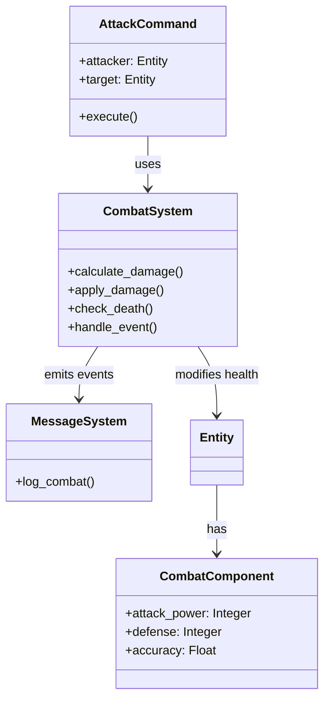

### Components

**New Component: `CombatComponent`**
- `attack_power`: Base damage dealt
- `defense`: Damage reduction
- `accuracy`: Hit chance (0.0-1.0)

### Systems

**New System: `CombatSystem` (Priority: 3.5, between Collision and Monster)**
- Processes `AttackCommand` objects
- Calculates damage with hit/miss logic
- Applies damage to `HealthComponent`
- Emits combat events
- Handles entity death

### Commands

**New Command: `AttackCommand`**
- Takes attacker and target entities
- Executes attack logic through CombatSystem
- Can be triggered from message system options

### Flow

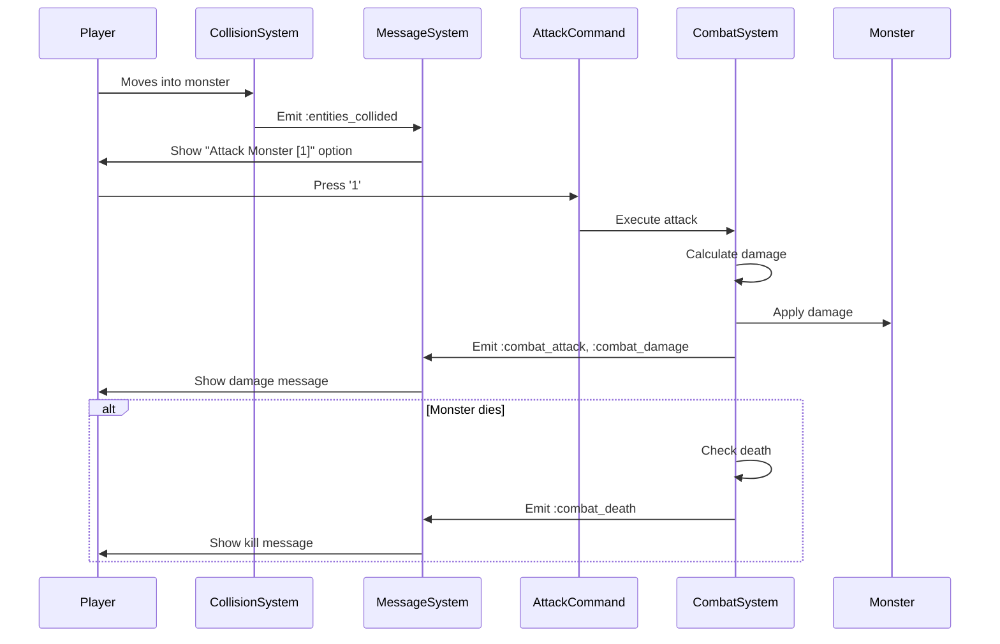

### TDD Implementation Plan

#### Phase 1: CombatComponent Tests
```ruby
# spec/lib/vanilla/components/combat_component_spec.rb
describe CombatComponent do
  describe '#initialize' do
    it 'sets attack_power, defense, and accuracy'
    it 'defaults accuracy to 0.8'
    it 'validates accuracy is between 0.0 and 1.0'
  end

  describe '#type' do
    it 'returns :combat'
  end

  describe '#to_hash' do
    it 'serializes component data'
  end
end
```

#### Phase 2: CombatSystem Tests
```ruby
# spec/lib/vanilla/systems/combat_system_spec.rb
describe CombatSystem do
  describe '#calculate_damage' do
    it 'calculates damage based on attack_power and defense'
    it 'applies minimum damage of 1'
    it 'handles miss based on accuracy'
  end

  describe '#apply_damage' do
    it 'reduces target health by damage amount'
    it 'does not reduce health below 0'
    it 'emits combat_damage event'
  end

  describe '#check_death' do
    it 'detects when entity health reaches 0'
    it 'emits combat_death event'
    it 'removes entity from world'
  end

  describe 'integration' do
    it 'handles full attack sequence'
    it 'handles player killing monster'
    it 'handles monster killing player'
  end
end
```

#### Phase 3: AttackCommand Tests
```ruby
# spec/lib/vanilla/commands/attack_command_spec.rb
describe AttackCommand do
  describe '#execute' do
    it 'calls CombatSystem to process attack'
    it 'handles invalid attacker'
    it 'handles invalid target'
    it 'handles attacker without CombatComponent'
  end
end
```

#### Phase 4: Integration Tests
```ruby
# spec/integration/combat_spec.rb
describe 'Combat Integration' do
  it 'player can attack monster on collision'
  it 'combat messages appear in message system'
  it 'monster dies after taking enough damage'
  it 'player can continue attacking same monster'
end
```

### Message System Integration

- When collision detected: Show "You bump into a monster! [1] Attack"
- On attack: Show "You strike the Goblin for 5 damage!"
- On miss: Show "You swing at the Goblin but miss!"
- On kill: Show "You slay the Goblin!"
- On player damage: Show "The Goblin hits you for 3 damage!"
- On player death: Show "You have fallen to the Goblin. Your adventure ends here."

### Pros
- Simple and straightforward
- Player has full control
- Easy to test
- Clear separation of concerns

### Cons
- Requires manual action for each attack
- May feel slow for multiple attacks
- No counter-attack mechanics

---

## Proposal 2: Automatic Combat on Collision

### Overview

Combat automatically initiates when the player collides with a monster. Each turn, both entities attack each other until one dies or the player moves away. This creates a more action-oriented feel where combat happens automatically but the player can still move to disengage.

### Architecture

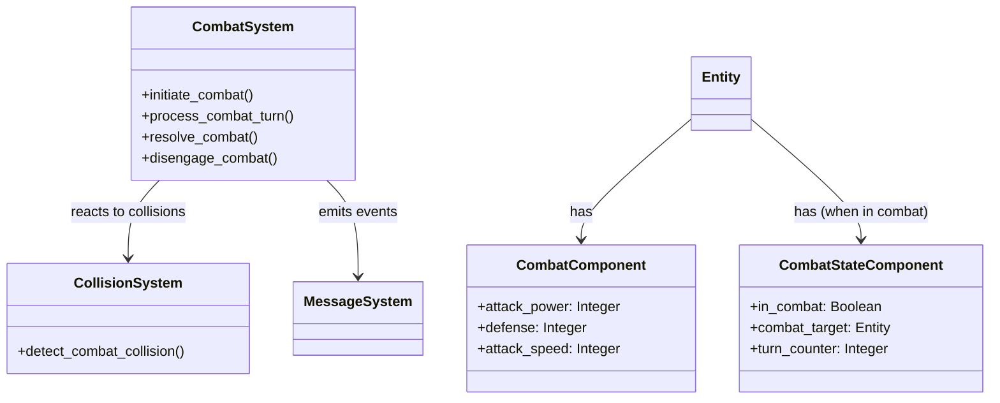

### Components

**New Component: `CombatComponent`**
- `attack_power`: Base damage
- `defense`: Damage reduction
- `attack_speed`: Attacks per turn (default 1)

**New Component: `CombatStateComponent`**
- `in_combat`: Boolean flag
- `combat_target`: Entity ID of opponent
- `turn_counter`: Tracks combat turns

### Systems

**New System: `CombatSystem` (Priority: 3.5)**
- Subscribes to `:entities_collided` events
- Automatically initiates combat on player-monster collision
- Processes combat each turn for entities in combat
- Resolves both attacker and defender attacks
- Disengages when entities separate

### Flow

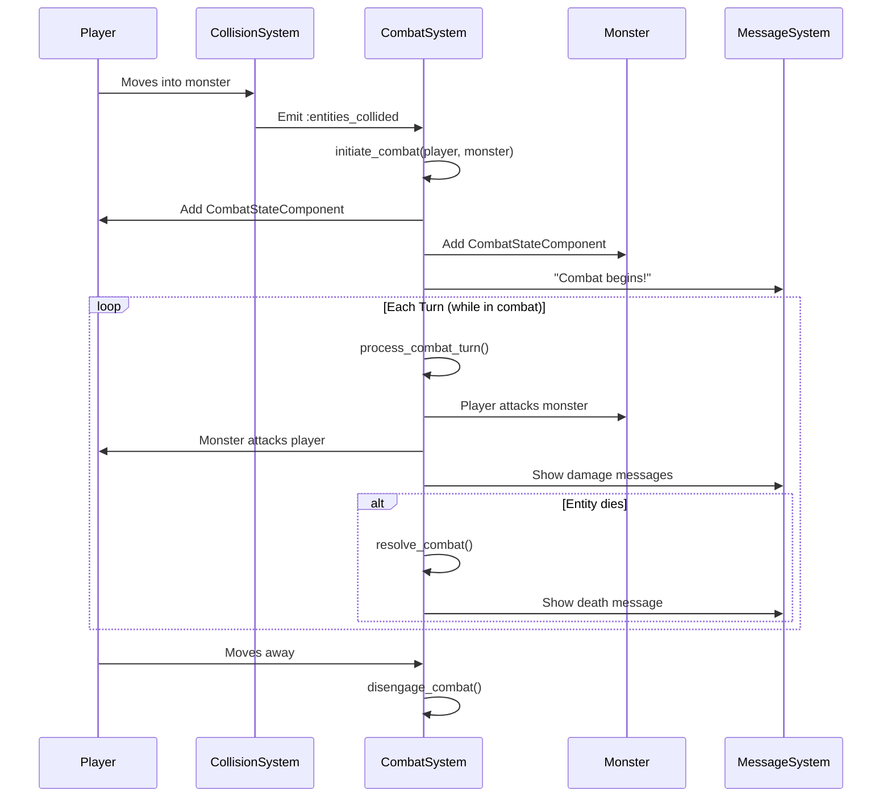

### TDD Implementation Plan

#### Phase 1: CombatComponent Tests
```ruby
describe CombatComponent do
  describe '#initialize' do
    it 'sets attack_power, defense, attack_speed'
    it 'defaults attack_speed to 1'
  end
end
```

#### Phase 2: CombatStateComponent Tests
```ruby
describe CombatStateComponent do
  describe '#initialize' do
    it 'sets in_combat to false by default'
    it 'allows setting combat target'
  end

  describe '#engage' do
    it 'sets in_combat to true'
    it 'sets combat_target'
  end

  describe '#disengage' do
    it 'sets in_combat to false'
    it 'clears combat_target'
  end
end
```

#### Phase 3: CombatSystem Tests
```ruby
describe CombatSystem do
  describe '#initiate_combat' do
    it 'adds CombatStateComponent to both entities'
    it 'emits combat_started event'
    it 'does not initiate if already in combat'
  end

  describe '#process_combat_turn' do
    it 'processes attacks for both entities'
    it 'handles turn order based on attack_speed'
    it 'skips if entities not in combat'
  end

  describe '#resolve_combat' do
    it 'removes dead entity from world'
    it 'disengages surviving entity'
    it 'emits combat_ended event'
  end

  describe '#disengage_combat' do
    it 'removes CombatStateComponent from entities'
    it 'emits combat_disengaged event'
  end

  describe 'event handling' do
    it 'initiates combat on player-monster collision'
    it 'disengages when entities separate'
  end
end
```

#### Phase 4: Integration Tests
```ruby
describe 'Automatic Combat Integration' do
  it 'combat starts automatically on collision'
  it 'both entities attack each turn'
  it 'combat ends when one entity dies'
  it 'player can move away to disengage'
  it 'combat messages appear each turn'
end
```

### Message System Integration

- On combat start: "Combat begins! You face the Goblin!"
- Each turn: "You strike the Goblin for 5 damage! The Goblin hits you for 3 damage!"
- On kill: "You slay the Goblin!"
- On disengage: "You break away from combat."
- On player death: "You have fallen to the Goblin. Your adventure ends here."

### Pros
- Fast-paced, action-oriented
- No manual attack commands needed
- Realistic simultaneous combat
- Player can disengage by moving

### Cons
- Less player control
- May feel overwhelming with multiple monsters
- Requires movement to escape combat

---

## Proposal 3: Combat State System with Combat Mode

### Overview

When the player collides with a monster, the game enters "Combat Mode" - a special state where movement is disabled and the player can only perform combat actions. The player chooses actions (Attack, Defend, Flee) via message system options. Combat continues until one entity dies or the player successfully flees.

### Architecture

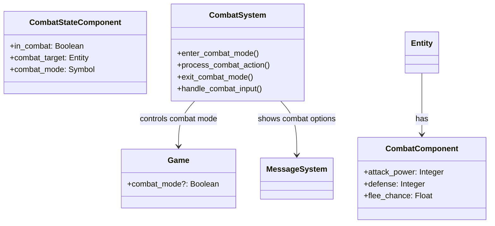

### Components

**New Component: `CombatComponent`**
- `attack_power`: Base damage
- `defense`: Damage reduction
- `flee_chance`: Probability of successful flee (0.0-1.0)

**New Component: `CombatStateComponent`**
- `in_combat`: Boolean flag
- `combat_target`: Entity ID
- `combat_mode`: `:player_turn`, `:enemy_turn`, `:resolving`

### Systems

**New System: `CombatSystem` (Priority: 3.5)**
- Manages combat mode state
- Processes combat actions (Attack, Defend, Flee)
- Handles turn-based combat flow
- Integrates with InputSystem to capture combat-specific input
- Blocks movement during combat

### Commands

**New Commands:**
- `AttackCommand`: Player attacks
- `DefendCommand`: Player defends (reduces incoming damage)
- `FleeCommand`: Player attempts to flee

### Flow

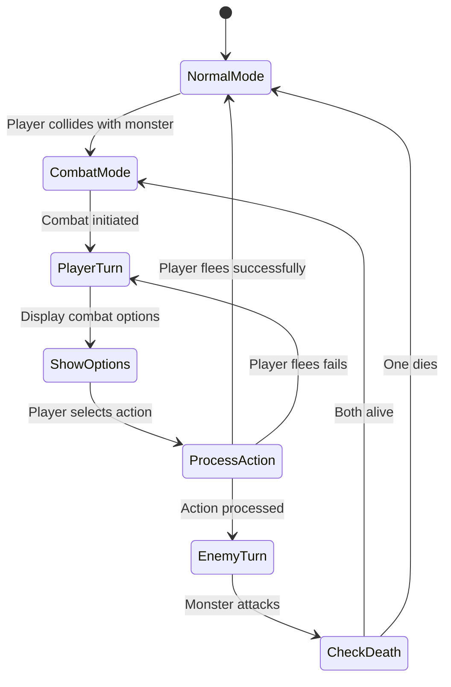

### TDD Implementation Plan

#### Phase 1: CombatComponent Tests
```ruby
describe CombatComponent do
  describe '#initialize' do
    it 'sets attack_power, defense, flee_chance'
    it 'defaults flee_chance to 0.3'
  end
end
```

#### Phase 2: CombatStateComponent Tests
```ruby
describe CombatStateComponent do
  describe '#enter_combat' do
    it 'sets in_combat to true'
    it 'sets combat_target'
    it 'sets combat_mode to :player_turn'
  end

  describe '#next_turn' do
    it 'switches between :player_turn and :enemy_turn'
  end
end
```

#### Phase 3: CombatSystem Tests
```ruby
describe CombatSystem do
  describe '#enter_combat_mode' do
    it 'adds CombatStateComponent to entities'
    it 'blocks player movement'
    it 'shows combat options in message system'
    it 'emits combat_started event'
  end

  describe '#process_attack' do
    it 'calculates and applies damage'
    it 'switches to enemy turn'
    it 'emits combat events'
  end

  describe '#process_defend' do
    it 'reduces incoming damage next turn'
    it 'switches to enemy turn'
  end

  describe '#process_flee' do
    it 'attempts to flee based on flee_chance'
    it 'exits combat on success'
    it 'stays in combat on failure'
  end

  describe '#process_enemy_turn' do
    it 'monster attacks player'
    it 'switches back to player turn'
  end

  describe '#exit_combat_mode' do
    it 'removes CombatStateComponent'
    it 'unblocks player movement'
    it 'emits combat_ended event'
  end
end
```

#### Phase 4: Command Tests
```ruby
describe AttackCommand do
  describe '#execute' do
    it 'only works in combat mode'
    it 'calls CombatSystem.process_attack'
  end
end

describe DefendCommand do
  describe '#execute' do
    it 'only works in combat mode'
    it 'calls CombatSystem.process_defend'
  end
end

describe FleeCommand do
  describe '#execute' do
    it 'only works in combat mode'
    it 'calls CombatSystem.process_flee'
  end
end
```

#### Phase 5: Integration Tests
```ruby
describe 'Combat Mode Integration' do
  it 'enters combat mode on collision'
  it 'blocks movement during combat'
  it 'shows combat options each turn'
  it 'player can attack, defend, or flee'
  it 'exits combat mode when combat ends'
  it 'monster attacks on enemy turn'
end
```

### Message System Integration

- On combat start: "Combat! You face the Goblin! [1] Attack [2] Defend [3] Flee"
- On attack: "You strike the Goblin for 5 damage!"
- On defend: "You brace for the attack!"
- On flee success: "You successfully flee from combat!"
- On flee failure: "You cannot escape! The Goblin blocks your path!"
- On enemy turn: "The Goblin attacks! You take 3 damage!"
- On kill: "You slay the Goblin! Combat ends."
- On player death: "You have fallen to the Goblin. Your adventure ends here."

### Pros
- Clear combat state
- Strategic choices (attack/defend/flee)
- Prevents accidental movement during combat
- Turn-based feel

### Cons
- More complex state management
- Requires blocking movement system
- May feel restrictive

---

## Proposal 4: Action-Point Based Combat System

### Overview

Entities have action points (AP) that determine how many actions they can take per turn. Combat actions consume AP. This allows for more tactical combat where players can attack multiple times, move and attack, or perform special actions based on available AP.

### Architecture

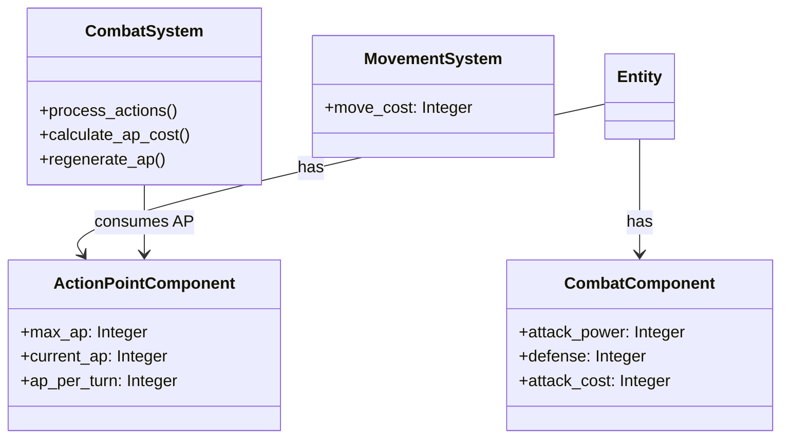

### Components

**New Component: `CombatComponent`**
- `attack_power`: Base damage
- `defense`: Damage reduction
- `attack_cost`: AP required to attack (default 2)

**New Component: `ActionPointComponent`**
- `max_ap`: Maximum AP (default 5)
- `current_ap`: Current available AP
- `ap_per_turn`: AP regenerated each turn (default 3)

### Systems

**New System: `CombatSystem` (Priority: 3.5)**
- Processes combat actions based on AP availability
- Regenerates AP each turn
- Validates actions have sufficient AP
- Integrates with MovementSystem for move+attack combos

**Modified System: `MovementSystem`**
- Consumes AP for movement (1 AP per move)
- Blocks movement if insufficient AP

### Commands

**New Command: `AttackCommand`**
- Checks if entity has sufficient AP
- Consumes AP on execution
- Executes attack

### Flow

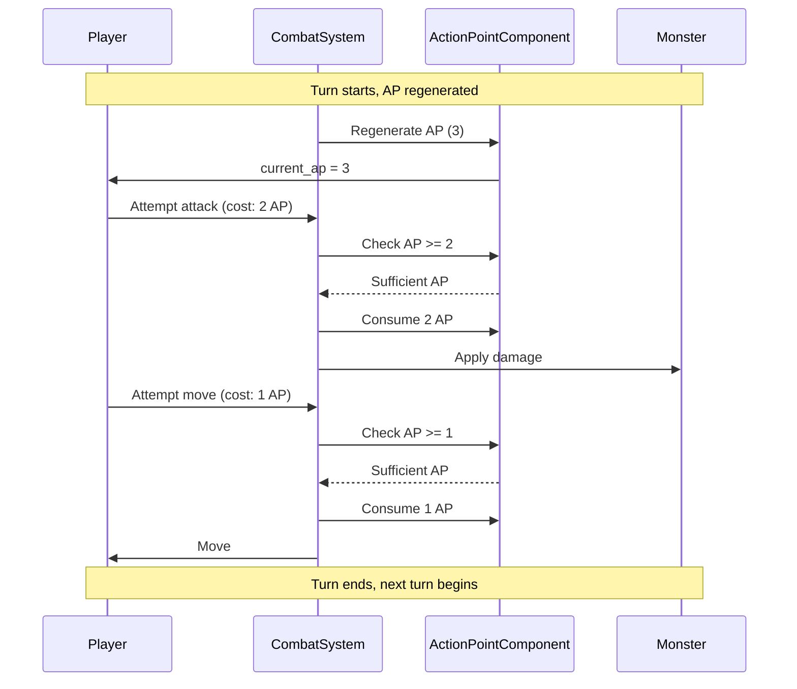

### TDD Implementation Plan

#### Phase 1: ActionPointComponent Tests
```ruby
describe ActionPointComponent do
  describe '#initialize' do
    it 'sets max_ap, current_ap, ap_per_turn'
    it 'defaults current_ap to max_ap'
  end

  describe '#consume' do
    it 'reduces current_ap by amount'
    it 'does not go below 0'
    it 'returns true if sufficient AP'
    it 'returns false if insufficient AP'
  end

  describe '#regenerate' do
    it 'adds ap_per_turn to current_ap'
    it 'does not exceed max_ap'
  end

  describe '#can_afford?' do
    it 'returns true if current_ap >= cost'
    it 'returns false if current_ap < cost'
  end
end
```

#### Phase 2: CombatComponent Tests
```ruby
describe CombatComponent do
  describe '#initialize' do
    it 'sets attack_power, defense, attack_cost'
    it 'defaults attack_cost to 2'
  end
end
```

#### Phase 3: CombatSystem Tests
```ruby
describe CombatSystem do
  describe '#regenerate_ap' do
    it 'regenerates AP for all entities with ActionPointComponent'
    it 'respects max_ap limit'
  end

  describe '#can_perform_action?' do
    it 'checks if entity has sufficient AP'
    it 'returns false if no ActionPointComponent'
  end

  describe '#process_attack' do
    it 'consumes attack_cost AP'
    it 'blocks attack if insufficient AP'
    it 'applies damage to target'
  end

  describe 'AP integration' do
    it 'allows multiple attacks if sufficient AP'
    it 'allows move + attack in same turn'
    it 'blocks actions when AP depleted'
  end
end
```

#### Phase 4: MovementSystem Modification Tests
```ruby
describe MovementSystem do
  describe 'AP integration' do
    it 'consumes 1 AP per movement'
    it 'blocks movement if insufficient AP'
    it 'allows movement if sufficient AP'
  end
end
```

#### Phase 5: Integration Tests
```ruby
describe 'Action Point Combat Integration' do
  it 'player can attack multiple times per turn'
  it 'player can move and attack in same turn'
  it 'AP regenerates each turn'
  it 'actions blocked when AP depleted'
  it 'combat messages show AP consumption'
end
```

### Message System Integration

- On turn start: "Your turn begins. AP: 3/5"
- On attack: "You attack the Goblin for 5 damage! (AP: 1/5)"
- On insufficient AP: "Not enough action points! (AP: 1/5, Required: 2)"
- On multiple attacks: "You attack twice! The Goblin takes 10 damage total!"
- On kill: "You slay the Goblin!"
- On player death: "You have fallen to the Goblin. Your adventure ends here."

### Pros
- Tactical depth
- Allows multiple actions per turn
- Strategic resource management
- Flexible action combinations

### Cons
- More complex to implement
- Requires AP tracking UI
- May be overwhelming for new players
- Requires modifying MovementSystem

---

## Proposal 5: Hybrid System with Manual and Auto-Combat

### Overview

A flexible system that supports both manual and automatic combat. Players can choose their preferred combat style. Manual mode works like Proposal 1 (attack commands), while auto mode works like Proposal 2 (automatic combat). The system can switch between modes, and players can toggle via settings or in-game command.

### Architecture

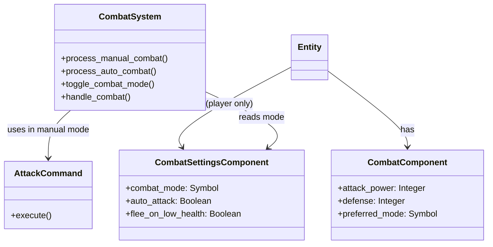

### Components

**New Component: `CombatComponent`**
- `attack_power`: Base damage
- `defense`: Damage reduction
- `preferred_mode`: `:manual` or `:auto` (for monsters)

**New Component: `CombatSettingsComponent` (Player only)**
- `combat_mode`: `:manual` or `:auto`
- `auto_attack`: Boolean flag
- `flee_on_low_health`: Auto-flee threshold (optional)

### Systems

**New System: `CombatSystem` (Priority: 3.5)**
- Detects combat mode from settings
- Routes to manual or auto combat logic
- Handles mode switching
- Processes combat based on selected mode

### Commands

**New Commands:**
- `AttackCommand`: For manual mode
- `ToggleCombatModeCommand`: Switch between manual/auto

### Flow

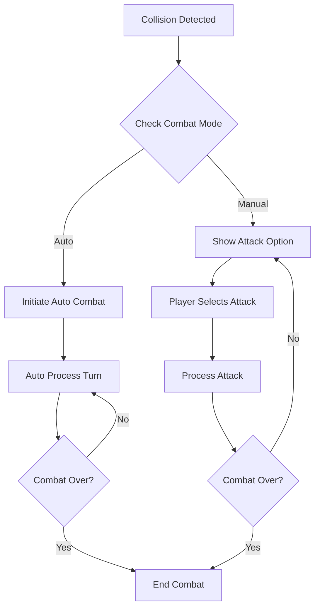

### TDD Implementation Plan

#### Phase 1: CombatSettingsComponent Tests
```ruby
describe CombatSettingsComponent do
  describe '#initialize' do
    it 'defaults to :manual mode'
    it 'allows setting combat_mode'
  end

  describe '#toggle_mode' do
    it 'switches between :manual and :auto'
  end
end
```

#### Phase 2: CombatComponent Tests
```ruby
describe CombatComponent do
  describe '#initialize' do
    it 'sets attack_power, defense, preferred_mode'
    it 'defaults preferred_mode to :auto for monsters'
  end
end
```

#### Phase 3: CombatSystem Tests
```ruby
describe CombatSystem do
  describe '#handle_combat' do
    it 'routes to manual combat when mode is :manual'
    it 'routes to auto combat when mode is :auto'
  end

  describe '#process_manual_combat' do
    it 'shows attack option in message system'
    it 'waits for AttackCommand'
    it 'processes attack on command'
  end

  describe '#process_auto_combat' do
    it 'automatically processes combat turns'
    it 'attacks both entities each turn'
    it 'continues until combat ends'
  end

  describe '#toggle_combat_mode' do
    it 'switches player combat mode'
    it 'emits combat_mode_changed event'
  end

  describe 'mode switching' do
    it 'can switch modes mid-combat'
    it 'preserves combat state on switch'
  end
end
```

#### Phase 4: ToggleCombatModeCommand Tests
```ruby
describe ToggleCombatModeCommand do
  describe '#execute' do
    it 'toggles player combat mode'
    it 'shows confirmation message'
  end
end
```

#### Phase 5: Integration Tests
```ruby
describe 'Hybrid Combat Integration' do
  it 'manual mode works like Proposal 1'
  it 'auto mode works like Proposal 2'
  it 'player can switch modes'
  it 'combat continues correctly after mode switch'
  it 'settings persist across sessions'
end
```

### Message System Integration

- On collision (manual): "You bump into a monster! [1] Attack"
- On collision (auto): "Combat begins! You face the Goblin!"
- Mode switch: "Combat mode: Auto" or "Combat mode: Manual"
- All combat messages from Proposals 1 and 2 apply based on mode

### Pros
- Maximum flexibility
- Appeals to different play styles
- Can switch modes as needed
- Best of both worlds

### Cons
- Most complex to implement
- Requires maintaining two combat systems
- More testing required
- Potential for mode confusion

---

## Proposal 6: Classic Rogue Combat System (Movement-Triggered)

### Overview

This proposal replicates the combat system from the original 1980 Rogue game. Combat is automatically triggered when the player moves into a monster's space. The system uses a D20-based hit calculation with level, armor class, and weapon bonuses. Damage uses dice notation (e.g., "2x3" = 2d3) with multiple attacks possible. Monsters automatically counter-attack on their turn when adjacent to the player.

### Architecture

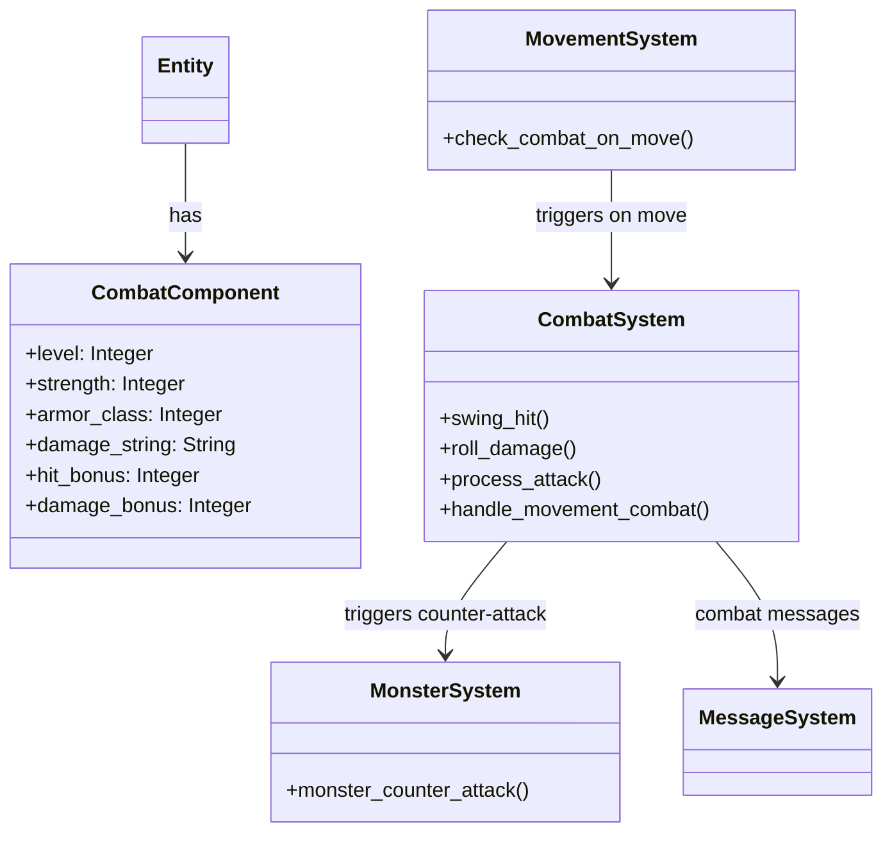

### Components

**New Component: `CombatComponent`**
- `level`: Entity level (affects hit chance)
- `strength`: Strength stat (affects hit and damage)
- `armor_class`: AC (lower is better, affects hit chance)
- `damage_string`: Dice notation like "2x3" or "1x4/1x2" (multiple attacks)
- `hit_bonus`: Weapon/enchantment bonus to hit
- `damage_bonus`: Weapon/enchantment bonus to damage

### Systems

**New System: `CombatSystem` (Priority: 2.5, between Movement and Collision)**
- `swing_hit(at_lvl, op_arm, wplus)`: D20-based hit calculation
  - Formula: `rnd(20) + wplus >= (20 - at_lvl) - op_arm`
- `roll_damage(damage_string, dplus, strength)`: Parses dice notation and rolls
- `process_attack(attacker, defender, weapon)`: Full attack resolution
- Subscribes to movement events to detect combat triggers

**Modified System: `MovementSystem`**
- When player moves into monster space, triggers combat immediately
- Combat happens before position update (player stays in place if attack fails)

**Modified System: `MonsterSystem`**
- Monsters automatically attack player when adjacent on their turn
- Uses same combat system as player attacks

### Combat Mechanics

**Hit Calculation (Classic Rogue Formula)**
```ruby
def swing_hit(attacker_level, defender_armor_class, weapon_bonus)
  roll = rand(1..20)
  need = (20 - attacker_level) - defender_armor_class
  roll + weapon_bonus >= need
end
```

**Damage Calculation**
- Parses damage strings: "2x3" = 2d3, "1x4/1x2" = two separate attacks
- Formula: `damage = damage_bonus + roll(ndice, nsides) + strength_bonus`
- Strength bonuses from lookup table (like original Rogue)

**Strength Bonuses**
- Hit bonus: `str_plus[strength]` (ranges from -7 to +3)
- Damage bonus: `add_dam[strength]` (ranges from -7 to +6)

### Flow

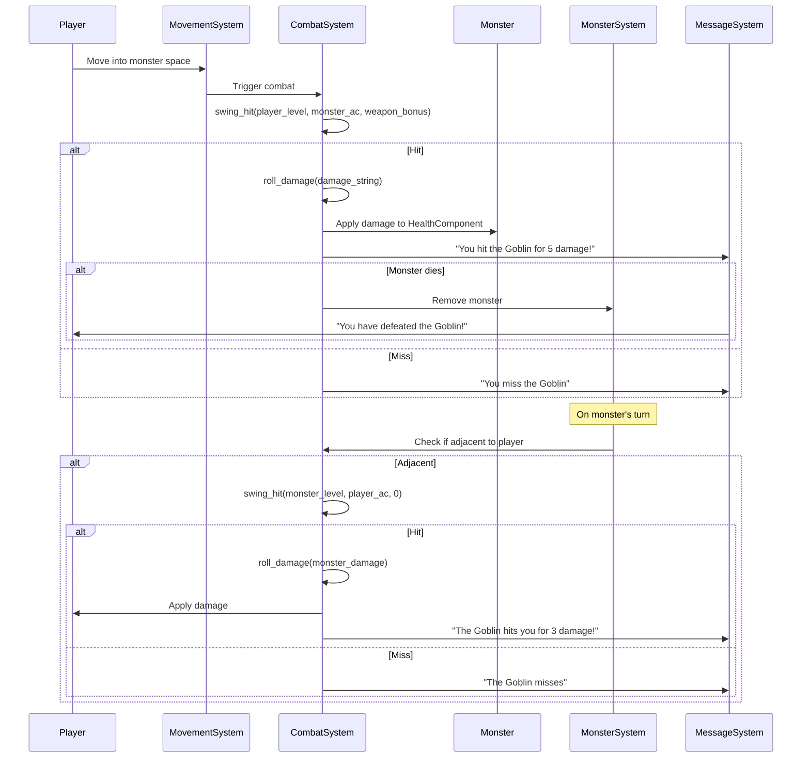

### TDD Implementation Plan

#### Phase 1: CombatComponent Tests
```ruby
# spec/lib/vanilla/components/combat_component_spec.rb
describe CombatComponent do
  describe '#initialize' do
    it 'sets level, strength, armor_class'
    it 'sets damage_string (e.g., "2x3")'
    it 'defaults hit_bonus and damage_bonus to 0'
    it 'validates damage_string format'
  end

  describe '#parse_damage_string' do
    it 'parses "2x3" into 2 dice, 3 sides'
    it 'parses "1x4/1x2" into multiple attacks'
    it 'handles invalid formats gracefully'
  end

  describe '#type' do
    it 'returns :combat'
  end
end
```

#### Phase 2: CombatSystem Hit Calculation Tests
```ruby
# spec/lib/vanilla/systems/combat_system_spec.rb
describe CombatSystem do
  describe '#swing_hit' do
    it 'calculates hit using D20 + bonuses vs target number'
    it 'higher attacker level increases hit chance'
    it 'lower defender AC increases hit chance'
    it 'weapon bonuses increase hit chance'
    it 'returns true on hit, false on miss'
  end

  describe '#calculate_strength_bonus' do
    it 'returns correct hit bonus for strength values'
    it 'returns correct damage bonus for strength values'
    it 'handles strength outside normal range'
  end
end
```

#### Phase 3: CombatSystem Damage Calculation Tests
```ruby
describe CombatSystem do
  describe '#roll_damage' do
    it 'rolls correct number of dice with correct sides'
    it 'applies damage_bonus'
    it 'applies strength damage bonus'
    it 'handles multiple attacks (e.g., "1x4/1x2")'
    it 'returns minimum damage of 1'
  end

  describe '#parse_damage_string' do
    it 'parses single attack "2x3"'
    it 'parses multiple attacks "1x4/1x2"'
    it 'handles edge cases'
  end
end
```

#### Phase 4: CombatSystem Integration Tests
```ruby
describe CombatSystem do
  describe '#process_attack' do
    it 'calls swing_hit to determine if attack hits'
    it 'applies damage on hit'
    it 'does not apply damage on miss'
    it 'emits combat_attack event'
    it 'emits combat_damage event on hit'
    it 'handles entity death'
  end

  describe 'movement-triggered combat' do
    it 'triggers combat when player moves into monster'
    it 'player stays in place if attack misses'
    it 'player moves into space if attack hits and monster dies'
    it 'player moves into space if attack hits and monster survives'
  end
end
```

#### Phase 5: MovementSystem Integration Tests
```ruby
describe MovementSystem do
  describe 'combat integration' do
    it 'checks for monster at target position before moving'
    it 'triggers combat if monster present'
    it 'only moves player if combat allows'
    it 'handles combat death during movement'
  end
end
```

#### Phase 6: MonsterSystem Counter-Attack Tests
```ruby
describe MonsterSystem do
  describe '#monster_counter_attack' do
    it 'monsters attack player when adjacent'
    it 'uses same combat system as player attacks'
    it 'only attacks on monster turn'
    it 'handles player death from counter-attack'
  end
end
```

#### Phase 7: Full Integration Tests
```ruby
describe 'Classic Rogue Combat Integration' do
  it 'player moves into monster, combat triggers automatically'
  it 'hit/miss messages appear correctly'
  it 'damage calculated with dice notation'
  it 'monster counter-attacks on its turn'
  it 'combat continues until one dies'
  it 'player can move away to avoid counter-attack'
  it 'multiple attacks work correctly (e.g., "1x4/1x2")'
end
```

### Message System Integration

- On move into monster: "You attack the Goblin!" (combat happens automatically)
- On hit: "You hit the Goblin" or "You scored an excellent hit on the Goblin!"
- On miss: "You miss" or "You swing and miss"
- Damage: Damage amount shown in message (implicit, not always stated in original)
- On kill: "You have defeated the Goblin!"
- Monster counter-attack hit: "The Goblin hits you" or "The Goblin swings and hits you"
- Monster counter-attack miss: "The Goblin misses" or "The Goblin swings and misses"
- On player death: "You have fallen to the Goblin. Your adventure ends here."

### Special Features (Future Enhancements)

Based on original Rogue, these could be added later:
- **Sleeping/Held Bonus**: +4 to hit against non-moving targets
- **Special Monster Abilities**: Poison, level drain, confusion on hit
- **Weapon Bonuses**: Different weapons have different hit/damage bonuses
- **Armor Protection**: Armor reduces incoming damage
- **Ring Bonuses**: Rings can add hit or damage bonuses

### Pros
- **Authentic**: Replicates the classic Rogue experience
- **Simple**: No separate combat mode needed
- **Fast-Paced**: Combat happens immediately on movement
- **Tactical**: Player can choose when to engage
- **Nostalgic**: Appeals to fans of classic roguelikes
- **Proven**: Battle-tested system from 1980

### Cons
- **Less Control**: No option to avoid combat once adjacent
- **Automatic**: May surprise players expecting manual combat
- **Complex Formulas**: D20 system with multiple modifiers
- **Dice Notation**: Requires parsing and validation
- **Counter-Attacks**: Monsters always attack back (no escape)

### Implementation Notes

1. **Damage String Format**: Use regex to parse "NxM" and "NxM/NxM" patterns
2. **Strength Tables**: Pre-calculate lookup tables for performance
3. **Random Seeding**: Use game's existing RNG for reproducibility
4. **Event Integration**: Emit events for all combat actions for logging
5. **Message Variants**: Support both terse and verbose message modes

---

## Comparison Matrix

| Feature | Proposal 1 | Proposal 2 | Proposal 3 | Proposal 4 | Proposal 5 | Proposal 6 |
|---------|-----------|-----------|-----------|-----------|-----------|-----------|
| **Complexity** | Low | Medium | High | Very High | Very High | Medium-High |
| **Player Control** | High | Low | Medium | High | Configurable | Medium |
| **Implementation Time** | 1-2 days | 2-3 days | 3-4 days | 4-5 days | 5-7 days | 3-4 days |
| **Test Coverage Needed** | Medium | Medium | High | Very High | Very High | High |
| **Strategic Depth** | Low | Low | Medium | High | Configurable | Medium |
| **Action Speed** | Slow | Fast | Medium | Variable | Configurable | Fast |
| **Message System Integration** | Simple | Simple | Complex | Medium | Complex | Simple-Medium |
| **ECS Alignment** | High | High | High | Medium | High | High |
| **Authenticity** | Low | Low | Low | Low | Low | **Very High** |
| **Classic Rogue Feel** | No | No | No | No | No | **Yes** |

## Recommendation

Based on the codebase's current state and the need for solid testing:

### Primary Recommendation: Proposal 1 (Simple Turn-Based Combat)

**Reasons:**
1. **TDD-Friendly**: Clear, testable components and systems
2. **Incremental**: Can be built and tested in phases
3. **ECS-Aligned**: Fits existing architecture patterns
4. **Message Integration**: Straightforward integration with existing message system
5. **Foundation**: Can be extended to other proposals later
6. **Testing Focus**: Allows comprehensive test coverage from the start

### Alternative Recommendation: Proposal 6 (Classic Rogue Combat)

**Consider Proposal 6 if:**
- You want to replicate the authentic 1980 Rogue experience
- You prefer movement-triggered combat (no separate combat mode)
- You want a proven, battle-tested system
- You're targeting roguelike purists and classic game fans
- You're comfortable with D20-based hit calculations and dice notation

**Reasons:**
1. **Authentic**: True to the original Rogue game
2. **Proven**: System has been tested by millions of players since 1980
3. **Fast-Paced**: Combat happens immediately, no mode switching
4. **Nostalgic Appeal**: Appeals to fans of classic roguelikes
5. **Well-Documented**: Original source code available for reference

**Implementation Order (Proposal 1):**
1. Start with Proposal 1
2. Add comprehensive tests (TDD approach)
3. Once stable, consider adding Proposal 2 features as an enhancement
4. Eventually evolve toward Proposal 5 for maximum flexibility

**Implementation Order (Proposal 6):**
1. Implement CombatComponent with level, strength, AC, and damage_string
2. Implement CombatSystem with swing_hit() and roll_damage()
3. Integrate with MovementSystem to trigger combat on move
4. Add monster counter-attack logic to MonsterSystem
5. Add comprehensive tests for all combat calculations
6. Test with various damage string formats and edge cases

## Next Steps

1. Review and discuss proposals with team
2. Select preferred proposal
3. Create detailed implementation plan with TDD test cases
4. Set up test infrastructure if needed
5. Begin implementation following TDD cycle (Red-Green-Refactor)

