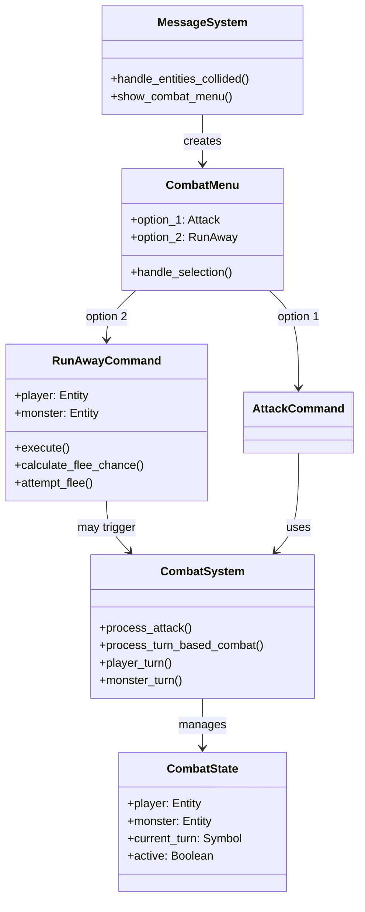

# Enhanced Combat Menu System - Proposal 002

## Overview

This proposal enhances the existing combat system (Proposal 1) by adding a proper combat menu when the player collides with a monster. The menu provides two clear options: attack or flee, with appropriate consequences for each choice. This creates a more engaging and strategic combat experience.

## Current State

The current implementation (Proposal 1) shows a combat collision message with an attack option, but:
- Only one option is available (attack)
- No way to disengage from combat
- Combat resolves immediately in a single attack
- No turn-based battle flow

## Proposed Changes

### 1. Enhanced Combat Menu

When a player collides with a monster, display a menu with two options:

```
You bump into a monster!

Options:
1) Attack Monster
2) Run Away
```

### 2. Run Away Mechanics

When the player chooses "Run Away":
- Player moves away from the monster (to adjacent tile if possible)
- 1-30% chance the monster gets a free attack on the player
- If the monster hits, apply damage normally
- Combat ends after the flee attempt
- Clear collision data

**Flee Chance Calculation:**
- Base chance: 1% minimum
- Maximum chance: 30%
- Could be based on monster speed/agility (future enhancement)
- Currently: Random between 1-30%

### 3. Attack Flow - Turn-Based Battle

When the player chooses "Attack Monster":
- Enter a combat state where player and monster alternate turns
- Player attacks first, then monster counter-attacks
- Continue until one entity dies
- Show combat messages for each action
- Display health status (optional, future enhancement)

**Combat Turn Sequence:**
1. Player turn: Player attacks monster
2. Monster turn: Monster attacks player (if still alive)
3. Repeat until one dies
4. Exit combat state

### 4. Combat State Management

Introduce a `CombatState` component or system to track:
- Active combat between player and monster
- Current turn (player or monster)
- Combat history/log

## Architecture



## Implementation Plan

### Phase 1: Enhanced Menu (TDD)

**Tests:**
- `spec/lib/vanilla/systems/message_system_combat_menu_spec.rb`
  - Test collision shows menu with 2 options
  - Test option 1 triggers attack
  - Test option 2 triggers run away
  - Test menu options are properly formatted

**Implementation:**
- Update `MessageSystem#handle_event(:entities_collided)` to show menu with 2 options
- Add "Run Away" option with callback `:run_away_from_monster`
- Ensure menu appears immediately on collision

### Phase 2: Run Away Command (TDD)

**Tests:**
- `spec/lib/vanilla/commands/run_away_command_spec.rb`
  - Test command initializes with player and monster
  - Test flee chance calculation (1-30%)
  - Test successful flee (no damage)
  - Test failed flee (monster attacks)
  - Test player moves away from monster
  - Test collision data is cleared after flee

**Implementation:**
- Create `RunAwayCommand` class
- Implement flee chance calculation (rand(1..30) / 100.0)
- If flee fails, monster gets one attack
- Move player to adjacent tile (away from monster)
- Clear collision data
- Add handler in `MessageSystem#handle_input` for `:run_away_from_monster`

### Phase 3: Turn-Based Combat Flow (TDD)

**Tests:**
- `spec/lib/vanilla/systems/combat_system_turn_based_spec.rb`
  - Test combat state is created on attack
  - Test player attacks first
  - Test monster counter-attacks after player
  - Test combat continues until one dies
  - Test combat state is cleared when combat ends
  - Test combat messages are shown for each turn

**Implementation:**
- Add `CombatState` tracking in `CombatSystem`
- Modify `CombatSystem#process_attack` to enter turn-based mode
- Implement `CombatSystem#process_turn_based_combat`
- Add `CombatSystem#player_turn` and `CombatSystem#monster_turn`
- Continue combat loop until one entity dies
- Clear combat state on completion

### Phase 4: Integration Tests

**Tests:**
- `spec/integration/enhanced_combat_spec.rb`
  - Test full flow: collision -> menu -> attack -> turn-based combat
  - Test full flow: collision -> menu -> run away -> flee chance
  - Test multiple combat rounds
  - Test player death in combat
  - Test monster death in combat
  - Test run away with successful flee
  - Test run away with failed flee (monster hits)

## Message System Integration

### New Messages

Add to `config/locales/en.yml`:

```yaml
combat:
  collision: "You bump into a %{enemy}!"
  menu_attack: "Attack %{enemy}"
  menu_run_away: "Run Away"
  flee_attempt: "You attempt to run away..."
  flee_success: "You successfully escape!"
  flee_failed: "The %{enemy} catches you as you flee!"
  combat_turn_player: "Your turn to attack!"
  combat_turn_monster: "The %{enemy} attacks!"
  combat_continues: "Combat continues..."
```

### Menu Options

```ruby
options: [
  { key: '1', content: "Attack Monster [1]", callback: :attack_monster },
  { key: '2', content: "Run Away [2]", callback: :run_away_from_monster }
]
```

## Code Changes

### 1. MessageSystem Updates

**File:** `lib/vanilla/systems/message_system.rb`

```ruby
when :entities_collided
  # ... existing code ...
  if entity&.has_tag?(:player) && other&.has_tag?(:monster)
    @last_collision_data = data
    enemy_name = other.name || "monster"
    add_message("combat.collision", 
      metadata: { enemy: enemy_name, x: data[:position][:row], y: data[:position][:column] },
      options: [
        { key: '1', content: "Attack #{enemy_name} [1]", callback: :attack_monster },
        { key: '2', content: "Run Away [2]", callback: :run_away_from_monster }
      ], 
      importance: :high, 
      category: :combat)
    process_message_queue
  end
```

### 2. New RunAwayCommand

**File:** `lib/vanilla/commands/run_away_command.rb` (new)

```ruby
module Vanilla
  module Commands
    class RunAwayCommand < Command
      FLEE_CHANCE_MIN = 0.01  # 1%
      FLEE_CHANCE_MAX = 0.30  # 30%

      attr_reader :player, :monster

      def initialize(player, monster)
        super()
        @player = player
        @monster = monster
        @logger = Vanilla::Logger.instance
      end

      def execute(world)
        return if @executed
        return unless @player && @monster

        # Calculate flee chance
        flee_chance = calculate_flee_chance
        @logger.info("[RunAwayCommand] Flee chance: #{flee_chance * 100}%")

        # Attempt to flee
        if rand < flee_chance
          # Successful flee
          move_player_away(world)
          world.emit_event(:combat_flee_success, {
            player_id: @player.id,
            monster_id: @monster.id
          })
          @logger.info("[RunAwayCommand] Player successfully fled")
        else
          # Failed flee - monster gets attack
          world.emit_event(:combat_flee_failed, {
            player_id: @player.id,
            monster_id: @monster.id
          })
          
          combat_system = world.systems.find { |s, _| s.is_a?(Vanilla::Systems::CombatSystem) }&.first
          if combat_system
            combat_system.process_attack(@monster, @player)
          end
          
          @logger.info("[RunAwayCommand] Player failed to flee, monster attacks")
        end

        @executed = true
      end

      private

      def calculate_flee_chance
        # Random between 1-30%
        min = FLEE_CHANCE_MIN
        max = FLEE_CHANCE_MAX
        min + (rand * (max - min))
      end

      def move_player_away(world)
        player_pos = @player.get_component(:position)
        monster_pos = @monster.get_component(:position)
        return unless player_pos && monster_pos

        # Find adjacent tile away from monster
        # Simple implementation: move in opposite direction
        dx = player_pos.row - monster_pos.row
        dy = player_pos.column - monster_pos.column

        # Normalize direction
        if dx.abs > dy.abs
          new_row = player_pos.row + (dx > 0 ? 1 : -1)
          new_col = player_pos.column
        else
          new_row = player_pos.row
          new_col = player_pos.column + (dy > 0 ? 1 : -1)
        end

        # Move player (if valid position)
        # This would need to check if position is valid/walkable
        # For now, just clear collision data
        message_system = Vanilla::ServiceRegistry.get(:message_system)
        message_system.instance_variable_set(:@last_collision_data, nil) if message_system
      end
    end
  end
end
```

### 3. CombatSystem Turn-Based Updates

**File:** `lib/vanilla/systems/combat_system.rb`

Add turn-based combat methods:

```ruby
# Track active combat
@active_combat = nil  # { player: Entity, monster: Entity, turn: :player }

def process_turn_based_combat(player, monster)
  return if @active_combat

  @active_combat = { player: player, monster: monster, turn: :player }
  @logger.info("[CombatSystem] Starting turn-based combat")

  # Combat loop
  while @active_combat && combat_active?
    if @active_combat[:turn] == :player
      player_turn
    else
      monster_turn
    end
    
    # Switch turns
    @active_combat[:turn] = @active_combat[:turn] == :player ? :monster : :player
  end

  # Clear combat state
  @active_combat = nil
end

def player_turn
  return unless @active_combat
  player = @active_combat[:player]
  monster = @active_combat[:monster]
  
  process_attack(player, monster)
end

def monster_turn
  return unless @active_combat
  player = @active_combat[:player]
  monster = @active_combat[:monster]
  
  process_attack(monster, player)
end

def combat_active?
  return false unless @active_combat
  
  player = @active_combat[:player]
  monster = @active_combat[:monster]
  
  player_health = player.get_component(:health)
  monster_health = monster.get_component(:health)
  
  player_health&.current_health&.> 0 && monster_health&.current_health&.> 0
end
```

### 4. Update AttackCommand

**File:** `lib/vanilla/commands/attack_command.rb`

Modify to start turn-based combat:

```ruby
def execute(world)
  return if @executed
  
  combat_system = world.systems.find { |s, _| s.is_a?(Vanilla::Systems::CombatSystem) }&.first
  return unless combat_system

  # If player is attacking, start turn-based combat
  if @attacker.has_tag?(:player)
    combat_system.process_turn_based_combat(@attacker, @target)
  else
    # Single attack for non-player
    combat_system.process_attack(@attacker, @target)
  end

  @executed = true
end
```

## TDD Test Plan

### Phase 1: Menu Tests

```ruby
# spec/lib/vanilla/systems/message_system_combat_menu_spec.rb
RSpec.describe Vanilla::Systems::MessageSystem do
  describe 'combat menu' do
    it 'shows menu with attack and run away options on collision' do
      # Test collision creates menu with 2 options
    end
    
    it 'option 1 triggers attack command' do
      # Test selecting option 1 queues AttackCommand
    end
    
    it 'option 2 triggers run away command' do
      # Test selecting option 2 queues RunAwayCommand
    end
  end
end
```

### Phase 2: Run Away Tests

```ruby
# spec/lib/vanilla/commands/run_away_command_spec.rb
RSpec.describe Vanilla::Commands::RunAwayCommand do
  describe '#execute' do
    it 'calculates flee chance between 1-30%' do
      # Test flee chance is in range
    end
    
    it 'successfully flees when chance succeeds' do
      # Test no damage on successful flee
    end
    
    it 'monster attacks when flee fails' do
      # Test monster gets attack on failed flee
    end
    
    it 'clears collision data after flee' do
      # Test collision data is cleared
    end
  end
end
```

### Phase 3: Turn-Based Combat Tests

```ruby
# spec/lib/vanilla/systems/combat_system_turn_based_spec.rb
RSpec.describe Vanilla::Systems::CombatSystem do
  describe 'turn-based combat' do
    it 'player attacks first' do
      # Test player turn happens first
    end
    
    it 'monster counter-attacks after player' do
      # Test monster attacks after player
    end
    
    it 'continues until one dies' do
      # Test combat loop continues
    end
    
    it 'clears combat state when combat ends' do
      # Test state is cleared
    end
  end
end
```

## Benefits

1. **Better UX**: Clear menu with two options gives player choice
2. **Strategic Depth**: Run away option adds risk/reward decision
3. **Engaging Combat**: Turn-based flow creates back-and-forth battle
4. **Extensible**: Easy to add more options (use item, cast spell, etc.)
5. **Realistic**: Flee chance adds tension to escape attempts

## Potential Issues & Solutions

### Issue 1: Combat Loop Blocking
**Problem**: Turn-based combat might block game loop
**Solution**: Process one turn per frame, use combat state to track progress

### Issue 2: Player Movement During Combat
**Problem**: Player might try to move during combat
**Solution**: Disable movement input while combat is active

### Issue 3: Multiple Monsters
**Problem**: What if player collides with another monster during combat?
**Solution**: Prevent new collisions while combat is active, or queue them

## Future Enhancements

1. **Flee Chance Factors**: Base on monster speed, player agility, terrain
2. **Combat UI**: Show health bars, damage numbers
3. **Combat Actions**: Add more options (use item, defend, etc.)
4. **Combat Log**: Show detailed combat history
5. **Combat Animations**: Visual feedback for attacks (future)

## Implementation Priority

1. **High**: Enhanced menu with 2 options
2. **High**: Run away command with flee chance
3. **Medium**: Turn-based combat flow
4. **Low**: Combat UI enhancements
5. **Low**: Advanced flee mechanics

## Estimated Effort

- Phase 1 (Menu): 2-3 hours
- Phase 2 (Run Away): 3-4 hours
- Phase 3 (Turn-Based): 4-6 hours
- Phase 4 (Integration): 2-3 hours
- **Total**: 11-16 hours

## Conclusion

This proposal enhances the combat system with a proper menu, flee mechanics, and turn-based combat flow. It builds on Proposal 1's foundation while adding strategic depth and better UX. The TDD approach ensures reliability and maintainability.

