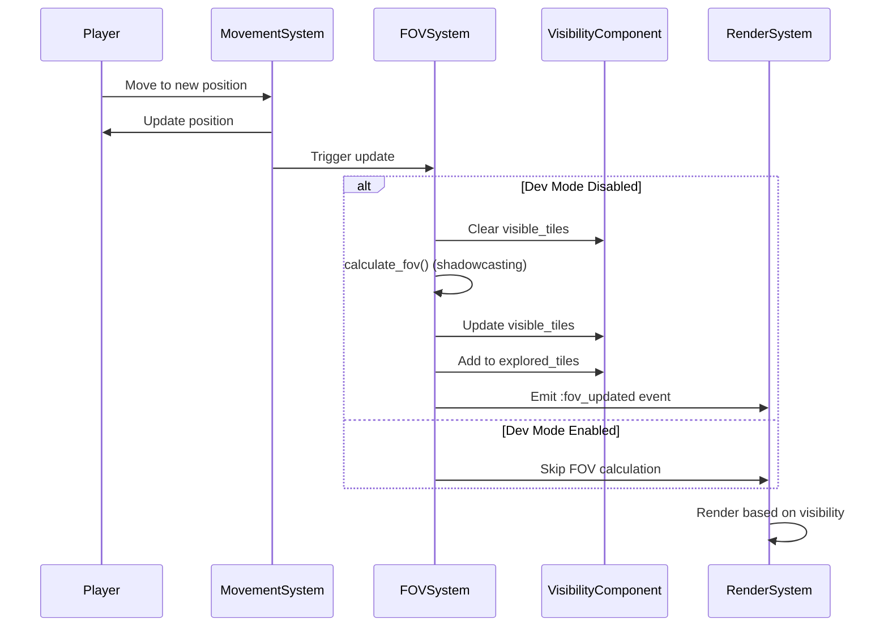
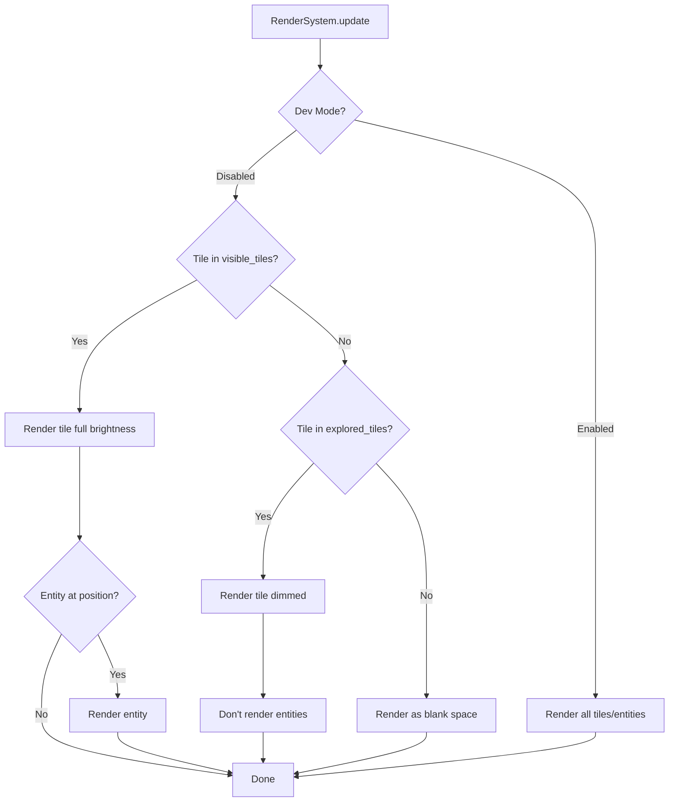
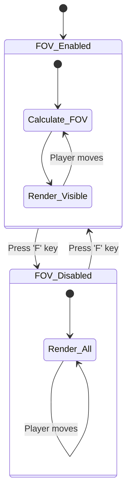

# Field of View and Fog of War System - Proposal 005

## Overview

Implement a Field of View (FOV) system that reveals the map progressively as the player explores. The player can only see entities and terrain within their line of sight, creating exploration tension and tactical depth. Previously explored tiles remain visible but dimmed (fog of war), while unexplored areas are completely hidden.

## Requirements

### Field of View Mechanics
- **Visibility Radius**: Player can see 8 tiles in all directions (configurable)
- **Line of Sight**: Walls and obstacles block visibility
- **Real-time Updates**: FOV recalculates every time the player moves
- **Fog of War**: Explored but not currently visible tiles are dimmed

### Developer Mode
- **Toggle Flag**: `--dev-mode` or `--fov-disabled` command-line flag
- **Runtime Toggle**: Press 'F' key (SHIFT + F) to toggle FOV on/off during gameplay
- **Visual Indicator**: Status line shows "DEV MODE: FOV OFF" when disabled
- **Full Map Visibility**: When disabled, entire map is visible (current behavior)

### Visibility States
1. **Unexplored**: Never seen before (completely hidden, rendered as ' ')
2. **Explored**: Previously seen but not currently visible (dimmed, no entities shown)
3. **Visible**: Currently in FOV (full brightness, entities shown)

### Entity Visibility Rules
- **Player**: Always visible (in their own FOV)
- **Monsters**: Only visible when in current FOV
- **Items**: Only visible when in current FOV
- **Stairs**: Only visible when in current FOV
- **Terrain**: Explored terrain always shown (walls, floors), but dimmed when not in FOV

## Architecture

### New Components

**VisibilityComponent**
```ruby
class VisibilityComponent < Component
  attr_accessor :vision_radius      # How far entity can see (default: 8)
  attr_accessor :visible_tiles      # Set of currently visible tile positions
  attr_accessor :explored_tiles     # Set of all explored tile positions
  attr_accessor :blocks_vision      # Boolean: does this entity block vision?

  def initialize(vision_radius: 8, blocks_vision: false)
    @vision_radius = vision_radius
    @visible_tiles = Set.new
    @explored_tiles = Set.new
    @blocks_vision = blocks_vision
  end
end
```

**DevModeComponent** (Player only)
```ruby
class DevModeComponent < Component
  attr_accessor :fov_disabled       # Boolean: FOV system disabled?
  attr_accessor :show_all_entities  # Boolean: show all entities?

  def initialize(fov_disabled: false)
    @fov_disabled = fov_disabled
    @show_all_entities = fov_disabled
  end

  def toggle_fov
    @fov_disabled = !@fov_disabled
    @show_all_entities = @fov_disabled
  end
end
```

### New Systems

**FOVSystem** (Priority: 2.5, between Movement and Collision)
```ruby
class FOVSystem < System
  def update(delta_time)
    entities_with(:visibility, :position).each do |entity|
      # Skip FOV calculation if dev mode enabled
      next if dev_mode_active?(entity)

      calculate_fov(entity)
      update_explored_tiles(entity)
    end
  end

  private

  def calculate_fov(entity)
    # Use recursive shadowcasting algorithm
    # Updates entity.visibility.visible_tiles
  end

  def update_explored_tiles(entity)
    # Add newly visible tiles to explored set
    visibility = entity.get_component(:visibility)
    visibility.explored_tiles.merge(visibility.visible_tiles)
  end

  def dev_mode_active?(entity)
    dev_mode = entity.get_component(:dev_mode)
    dev_mode&.fov_disabled || false
  end
end
```

### Modified Systems

**RenderSystem**
- Check visibility before rendering entities
- Render explored tiles with dimmed colors
- Render unexplored tiles as blank space
- Override visibility checks when dev mode active

**MonsterSystem**
- Monsters only pathfind toward player when player is visible
- Could add "last known position" mechanic (future enhancement)

### New Commands

**ToggleFOVCommand**
```ruby
class ToggleFOVCommand < Command
  def execute(world)
    player = world.find_entity_by_tag(:player)
    dev_mode = player&.get_component(:dev_mode)

    if dev_mode
      dev_mode.toggle_fov
      mode_text = dev_mode.fov_disabled ? "OFF" : "ON"
      world.emit_event(:dev_mode_toggled, { fov: mode_text })
    end
  end
end
```

## FOV Algorithm: Recursive Shadowcasting

### Algorithm Choice
Using **Recursive Shadowcasting** for these reasons:
- Accurate and symmetric (player can see monster = monster can see player)
- Efficient (O(n) where n = visible tiles)
- Well-established in roguelike community
- Handles edge cases gracefully

### Pseudocode
```ruby
def calculate_fov(entity)
  position = entity.get_component(:position)
  visibility = entity.get_component(:visibility)

  # Clear current visible tiles
  visibility.visible_tiles.clear

  # Player's tile is always visible
  visibility.visible_tiles.add([position.row, position.col])

  # Cast shadows in 8 octants
  8.times do |octant|
    cast_light(
      position.row,
      position.col,
      1, # start_row
      1.0, # start_slope
      0.0, # end_slope
      visibility.vision_radius,
      octant,
      visibility.visible_tiles
    )
  end
end

def cast_light(cx, cy, row, start_slope, end_slope, radius, octant, visible_tiles)
  return if start_slope < end_slope

  row_min = -radius
  row_max = radius

  (row..radius).each do |current_row|
    current_col = (start_slope * current_row).floor
    max_col = (end_slope * current_row).ceil

    while current_col <= max_col
      # Transform coordinates based on octant
      world_x, world_y = transform_octant(cx, cy, current_row, current_col, octant)

      # Check if in bounds
      next unless in_bounds?(world_x, world_y)

      # Add to visible set
      visible_tiles.add([world_x, world_y])

      # Check if tile blocks vision (wall)
      if blocks_vision?(world_x, world_y)
        # Handle shadow recursion
        # ... (full implementation details)
      end

      current_col += 1
    end
  end
end
```

### Alternative: Bresenham's Line Algorithm
- Simpler to implement
- Less accurate (asymmetric visibility)
- Good for initial implementation
- Can upgrade to shadowcasting later

## Flow Diagrams

### FOV Calculation Flow


### Rendering Flow with FOV


### Dev Mode Toggle Flow


## TDD Implementation Plan

### Phase 1: VisibilityComponent Tests
```ruby
# spec/lib/vanilla/components/visibility_component_spec.rb
describe VisibilityComponent do
  describe '#initialize' do
    it 'sets vision_radius to 8 by default'
    it 'initializes visible_tiles as empty Set'
    it 'initializes explored_tiles as empty Set'
    it 'sets blocks_vision to false by default'
    it 'allows custom vision_radius'
  end

  describe '#type' do
    it 'returns :visibility'
  end

  describe '#to_hash' do
    it 'serializes component data'
    it 'converts Sets to Arrays for serialization'
  end

  describe '#from_hash' do
    it 'deserializes component data'
    it 'converts Arrays back to Sets'
  end

  describe '#add_visible_tile' do
    it 'adds tile to visible_tiles Set'
  end

  describe '#clear_visible_tiles' do
    it 'clears visible_tiles Set'
  end

  describe '#tile_visible?' do
    it 'returns true if tile in visible_tiles'
    it 'returns false if tile not in visible_tiles'
  end

  describe '#tile_explored?' do
    it 'returns true if tile in explored_tiles'
    it 'returns false if tile not in explored_tiles'
  end
end
```

### Phase 2: DevModeComponent Tests
```ruby
# spec/lib/vanilla/components/dev_mode_component_spec.rb
describe DevModeComponent do
  describe '#initialize' do
    it 'sets fov_disabled to false by default'
    it 'sets show_all_entities based on fov_disabled'
    it 'allows initializing with fov_disabled: true'
  end

  describe '#toggle_fov' do
    it 'switches fov_disabled from false to true'
    it 'switches fov_disabled from true to false'
    it 'updates show_all_entities accordingly'
  end

  describe '#type' do
    it 'returns :dev_mode'
  end
end
```

### Phase 3: FOVSystem - Basic Tests
```ruby
# spec/lib/vanilla/systems/fov_system_spec.rb
describe FOVSystem do
  let(:world) { instance_double(World) }
  let(:fov_system) { FOVSystem.new(world) }

  describe '#update' do
    it 'processes entities with visibility and position components'
    it 'skips entities without visibility component'
    it 'skips FOV calculation when dev mode enabled'
  end

  describe '#calculate_fov' do
    context 'in empty room (no walls)' do
      it 'makes all tiles within radius visible'
      it 'respects vision_radius limit'
      it 'includes player position in visible tiles'
    end

    context 'with walls blocking vision' do
      it 'blocks vision behind walls'
      it 'does not make tiles behind walls visible'
      it 'correctly handles corner cases'
    end
  end

  describe '#update_explored_tiles' do
    it 'adds newly visible tiles to explored set'
    it 'retains previously explored tiles'
    it 'does not remove tiles from explored set'
  end

  describe '#dev_mode_active?' do
    it 'returns true when entity has dev_mode component with fov_disabled'
    it 'returns false when entity has no dev_mode component'
    it 'returns false when dev_mode.fov_disabled is false'
  end
end
```

### Phase 4: FOVSystem - Shadowcasting Algorithm Tests
```ruby
describe FOVSystem do
  describe 'shadowcasting algorithm' do
    it 'calculates FOV symmetrically (if A sees B, B sees A)'
    it 'handles all 8 octants correctly'
    it 'stops at maximum vision radius'
    it 'correctly transforms octant coordinates'

    context 'with various wall configurations' do
      it 'handles single wall blocking'
      it 'handles L-shaped corridors'
      it 'handles rooms connected by doorways'
      it 'handles diagonal walls'
      it 'handles pillars (single blocking tiles)'
    end

    context 'edge cases' do
      it 'handles vision radius of 0 (only current tile visible)'
      it 'handles vision radius of 1'
      it 'handles very large vision radius (100+)'
      it 'handles player at map edge'
      it 'handles player in corner'
    end
  end

  describe '#blocks_vision?' do
    it 'returns true for walls'
    it 'returns false for floors'
    it 'returns false for entities (monsters, items)'
    it 'queries cell.blocks_vision? from grid'
  end

  describe '#in_bounds?' do
    it 'returns true for coordinates within grid'
    it 'returns false for coordinates outside grid'
  end

  describe '#transform_octant' do
    it 'correctly transforms coordinates for octant 0'
    it 'correctly transforms coordinates for octant 1'
    it 'correctly transforms coordinates for octant 2'
    # ... test all 8 octants
  end
end
```

### Phase 5: RenderSystem Integration Tests
```ruby
# spec/lib/vanilla/systems/render_system_fov_spec.rb
describe RenderSystem do
  describe 'FOV integration' do
    context 'when dev mode disabled' do
      it 'renders only visible tiles at full brightness'
      it 'renders explored tiles dimmed'
      it 'renders unexplored tiles as blank'
      it 'only renders entities in visible tiles'
      it 'does not render entities in explored but not visible tiles'
    end

    context 'when dev mode enabled' do
      it 'renders all tiles regardless of visibility'
      it 'renders all entities regardless of visibility'
      it 'shows "DEV MODE: FOV OFF" indicator'
    end

    describe 'dimming implementation' do
      it 'uses dim color palette for explored tiles'
      it 'uses full color palette for visible tiles'
      it 'dims walls, floors, and corridors'
    end
  end
end
```

### Phase 6: ToggleFOVCommand Tests
```ruby
# spec/lib/vanilla/commands/toggle_fov_command_spec.rb
describe ToggleFOVCommand do
  describe '#execute' do
    it 'toggles dev_mode.fov_disabled'
    it 'emits :dev_mode_toggled event'
    it 'includes current FOV state in event'
    it 'handles player without dev_mode component gracefully'
  end
end
```

### Phase 7: InputHandler Integration Tests
```ruby
# spec/lib/vanilla/input_handler_fov_spec.rb
describe InputHandler do
  describe 'FOV toggle key' do
    it 'maps "f" key to ToggleFOVCommand'
    it 'maps "F" key to ToggleFOVCommand'
    it 'works during normal gameplay'
  end
end
```

### Phase 8: Command-Line Flag Tests
```ruby
# spec/lib/vanilla/game_fov_spec.rb
describe Game do
  describe '--dev-mode flag' do
    it 'initializes player with dev_mode component'
    it 'sets fov_disabled to true'
  end

  describe '--fov-disabled flag' do
    it 'initializes player with dev_mode component'
    it 'sets fov_disabled to true'
  end

  describe 'without flags' do
    it 'does not add dev_mode component'
    it 'FOV is enabled by default'
  end
end
```

### Phase 9: Integration Tests
```ruby
# spec/integration/fov_spec.rb
describe 'Field of View Integration' do
  it 'player starts with tiles around them visible'
  it 'moving reveals new tiles'
  it 'previously visible tiles become explored'
  it 'monsters only visible when in FOV'
  it 'items only visible when in FOV'

  context 'maze exploration' do
    it 'walking down corridor progressively reveals tiles'
    it 'turning corner reveals new area'
    it 'walls block vision to rooms beyond'
  end

  context 'dev mode' do
    it 'full map visible when dev mode enabled'
    it 'toggling FOV works during gameplay'
    it 'FOV recalculates when re-enabled'
  end

  context 'edge cases' do
    it 'handles player starting at map edge'
    it 'handles very small vision radius'
    it 'handles very large maps'
    it 'handles completely enclosed spaces'
  end
end
```

## Message System Integration

### New Messages
```yaml
fov:
  dev_mode_enabled: "DEV MODE: FOV disabled - Full map visible"
  dev_mode_disabled: "FOV enabled - Exploration mode active"
  vision_blocked: "You cannot see beyond the walls."
```

### Status Line Integration
- Show "DEV MODE: FOV OFF" when dev mode active
- Show vision radius: "Vision: 8 tiles"
- Optional: Show explored percentage: "Explored: 45%"

## Implementation Details

### Dimming Colors
```ruby
# RenderSystem color dimming
DIMMED_COLORS = {
  white: :dark_gray,
  yellow: :brown,
  green: :dark_green,
  blue: :dark_blue,
  red: :dark_red,
  cyan: :dark_cyan,
  magenta: :dark_magenta
}

def render_tile(tile, visibility_state)
  case visibility_state
  when :visible
    render_with_color(tile, tile.color)
  when :explored
    dimmed_color = DIMMED_COLORS[tile.color] || :dark_gray
    render_with_color(tile, dimmed_color)
  when :unexplored
    render_char(' ')
  end
end
```

### Grid Integration
Walls should have a `blocks_vision` property:
```ruby
class Cell
  attr_accessor :blocks_vision

  def initialize
    @blocks_vision = false  # Passages don't block vision
  end

  # When wall is created
  def add_wall
    @blocks_vision = true
  end
end
```

### Performance Considerations
- FOV calculation: O(n) where n = tiles within vision radius
- For vision radius 8: ~200 tiles checked per calculation
- Runs once per player movement (not every frame)
- Cache visible_tiles Set for fast lookups during rendering
- Use Set for O(1) visibility checks

## Testing Strategy

### Unit Tests
1. Component serialization/deserialization
2. FOV algorithm correctness (all octants)
3. Dev mode toggle logic
4. Visibility state transitions

### Integration Tests
1. Full exploration flow (move → calculate FOV → render)
2. Dev mode flag from command-line
3. Runtime toggle with 'F' key
4. Entity visibility based on FOV

### Edge Cases
1. Vision radius edge cases (0, 1, very large)
2. Player at map boundaries
3. Complex wall configurations (L-shapes, pillars)
4. Dev mode toggle during gameplay
5. Serialization/deserialization of explored tiles

### Visual Testing
1. Manual testing of different maze configurations
2. Verify dimming is visually clear
3. Test fog of war appearance
4. Verify dev mode indicator is visible

## Command-Line Flags

### Implementation
```ruby
# bin/play.rb
options = {}
OptionParser.new do |opts|
  opts.on("--dev-mode", "Enable developer mode (disables FOV)") do
    options[:dev_mode] = true
  end

  opts.on("--fov-disabled", "Disable field of view system") do
    options[:fov_disabled] = true
  end
end

# In Game#initialize
def initialize(options = {})
  # ... existing code ...

  if options[:dev_mode] || options[:fov_disabled]
    player.add_component(DevModeComponent.new(fov_disabled: true))
  end
end
```

## Runtime Toggle

### Implementation
```ruby
# lib/vanilla/input_handler.rb
def handle_input(char)
  case char
  when 'f', 'F'
    ToggleFOVCommand.new
  # ... existing mappings ...
  end
end
```

## Pros

- **Exploration Depth**: Creates sense of discovery and unknown
- **Tactical Gameplay**: Can't see monsters until they're close
- **Performance**: Efficient shadowcasting algorithm
- **Dev-Friendly**: Easy to toggle for testing and debugging
- **Classic Roguelike**: Standard feature in traditional roguelikes
- **Replayability**: Each playthrough feels like fresh exploration

## Cons

- **Visual Complexity**: More rendering states to manage
- **Algorithm Complexity**: Shadowcasting is non-trivial
- **Testing Overhead**: Many edge cases to test
- **Potential Confusion**: New players may find it disorienting initially

## Future Enhancements

1. **Light Sources**: Torches/lanterns that increase vision radius
2. **Monster Memory**: Show last known position of monsters
3. **Telepathy**: Magic items that reveal all monsters
4. **Blind Status**: Reduce vision radius when affected by blindness
5. **Monster FOV**: Monsters have their own vision radius
6. **Sound**: Hear monsters outside FOV
7. **Exploration Stats**: Track % of map explored, display on death

## References

- [RogueBasin: Field of Vision](http://roguebasin.com/index.php?title=Field_of_Vision)
- [Recursive Shadowcasting Algorithm](http://roguebasin.com/index.php?title=FOV_using_recursive_shadowcasting)
- [Python Roguelike Tutorial: FOV](http://rogueliketutorials.com/tutorials/tcod/v2/part-4/)

## Next Steps

1. Review and discuss proposal
2. Decide on initial FOV algorithm (Bresenham vs Shadowcasting)
3. Set up test infrastructure for FOV testing
4. Implement Phase 1: Components and basic structure
5. Implement Phase 2: FOV calculation algorithm
6. Implement Phase 3: Rendering integration
7. Implement Phase 4: Dev mode and toggle
8. Visual testing and refinement
