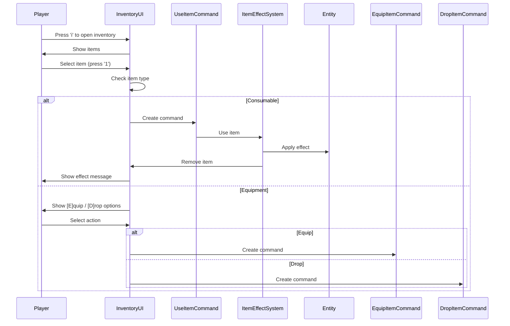
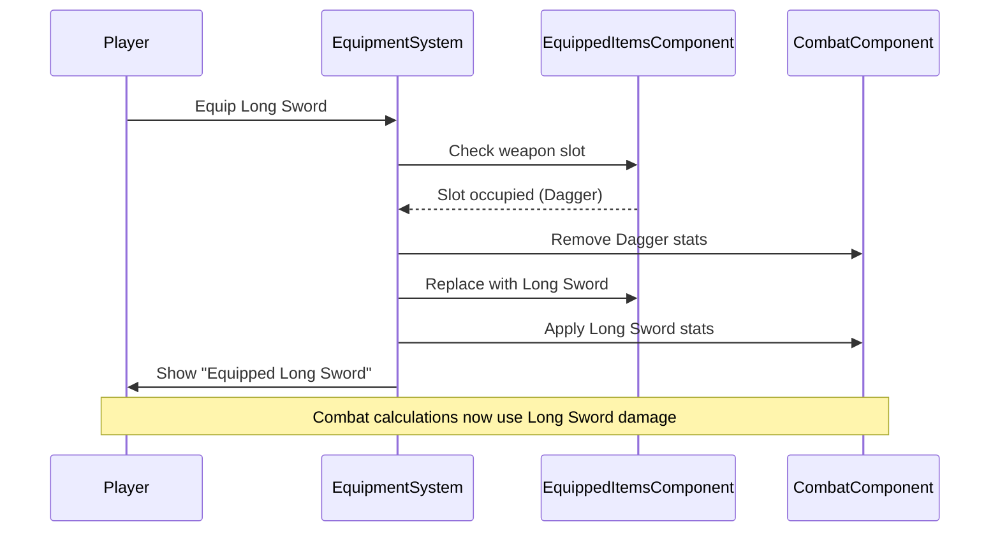
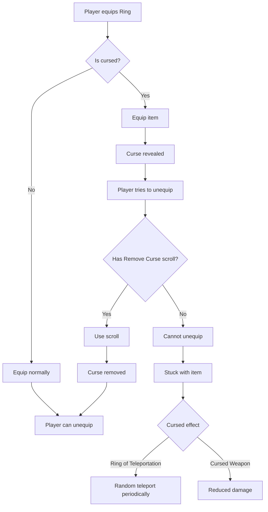
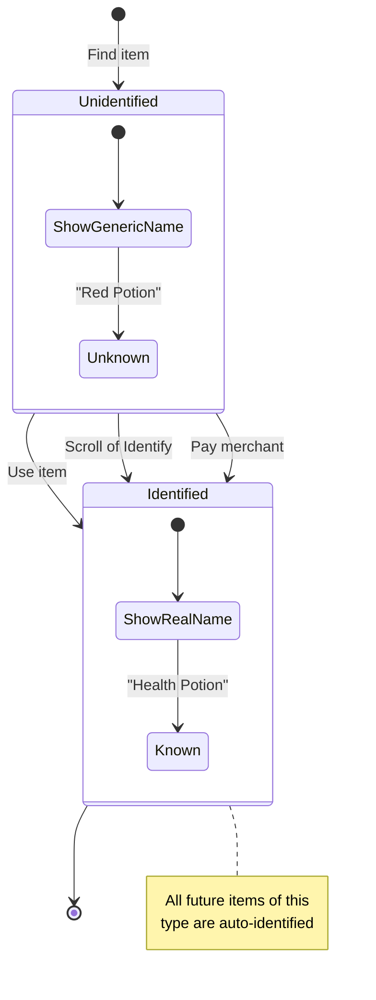

# Item Usage and Effects System - Proposal 006

## Overview

Transform the placeholder inventory system into a fully functional item usage system with consumables, equipment, and magical effects. This includes potions, scrolls, weapons, armor, rings, and other classic roguelike items. Each item type has specific effects, usage patterns, and interactions with the player's stats and abilities.

## Requirements

### Item Categories

#### 1. Consumables
- **Potions**: Single-use, immediate effect
  - Health Potion: Restore HP
  - Mana Potion: Restore mana (if magic system exists)
  - Strength Potion: Temporary +2 strength for 10 turns
  - Poison Potion: Deals damage over time
  - Confusion Potion: Throw at monster to confuse it
- **Food**: Prevents hunger (if hunger system implemented)
  - Apple: Restore 5 HP
  - Bread: Satisfy hunger partially
  - Ration: Full hunger restoration
- **Scrolls**: Single-use, magical effect
  - Scroll of Teleportation: Random teleport
  - Scroll of Identify: Reveal unknown item
  - Scroll of Magic Mapping: Reveal entire map
  - Scroll of Enchantment: Improve weapon/armor
  - Scroll of Remove Curse: Remove cursed items

#### 2. Equipment
- **Weapons**: Modifies combat stats
  - Dagger: 1d4 damage, +1 hit
  - Short Sword: 1d6 damage, +0 hit
  - Long Sword: 2d4 damage, +1 hit
  - Mace: 2d3 damage, +0 hit, +1 vs undead
  - Enchanted variants: +1, +2, +3 bonuses
- **Armor**: Reduces incoming damage
  - Leather Armor: AC 8, no penalties
  - Chain Mail: AC 6, -1 movement speed
  - Plate Mail: AC 4, -2 movement speed
  - Enchanted variants: +1, +2, +3 to AC
- **Rings**: Passive effects
  - Ring of Protection: +1 AC
  - Ring of Strength: +1 strength
  - Ring of Regeneration: Heal 1 HP every 10 turns
  - Ring of See Invisible: Reveal invisible monsters
  - Ring of Teleportation: Random teleport (can be cursed)

#### 3. Special Items
- **Wands**: Limited charges, targeted effects
  - Wand of Lightning: 3d6 damage in line
  - Wand of Polymorph: Transform monster into another type
  - Wand of Slow Monster: Reduces monster speed
- **Amulets**: Unique passive effects
  - Amulet of Yendor: Win condition (classic Rogue)

### Item Properties

**All Items**
- `name`: Display name (e.g., "Health Potion")
- `type`: Item category (`:consumable`, `:weapon`, `:armor`, `:ring`, `:scroll`, `:wand`)
- `identified`: Boolean - known or unknown
- `cursed`: Boolean - cursed items can't be unequipped
- `quantity`: Stack size (for stackable items)

**Consumables**
- `effect_type`: What happens when used (`:heal`, `:buff`, `:teleport`, etc.)
- `effect_magnitude`: Strength of effect (HP restored, buff duration, etc.)
- `target_type`: `:self`, `:monster`, `:area`

**Equipment**
- `slot`: Where equipped (`:weapon`, `:armor`, `:ring_left`, `:ring_right`)
- `bonus`: Enchantment level (+0, +1, +2, etc.)
- `equipped`: Boolean - currently equipped?
- `stat_modifiers`: Hash of stat changes (`{ strength: +1, ac: -2 }`)

**Wands**
- `charges`: Remaining uses
- `max_charges`: Starting charges

### Item Identification System

**Unknown Items**
- Potions: "Red Potion", "Blue Potion", "Green Potion"
- Scrolls: "Scroll labeled XYZZY", "Scroll labeled FOOBAR"
- Rings: "Copper Ring", "Iron Ring", "Gold Ring"
- Unknown items show generic description until identified

**Identification Methods**
1. **Use the item**: Automatically identifies (risky!)
2. **Scroll of Identify**: Safe identification
3. **Pay merchant**: Gold cost (if merchant system exists)

**Persistence**
- Once identified, all items of that type are known
- Identification state persists across game sessions (per save file)

### Usage Flow

#### Consumables
1. Player presses 'i' to open inventory
2. Select item with number key
3. Confirm usage
4. Effect applied immediately
5. Item removed from inventory

#### Equipment
1. Player presses 'i' to open inventory
2. Select equipment item
3. Show options: `[E]quip` or `[D]rop`
4. If equipping:
   - Remove currently equipped item in that slot (if any)
   - Equip new item
   - Apply stat modifiers
5. If dropping:
   - Remove from inventory
   - Place on ground at player position

#### Cursed Items
1. Cursed items can be equipped normally
2. Once equipped, cannot be removed
3. Show message: "The Ring of Teleportation is stuck on your finger!"
4. Can only remove with Scroll of Remove Curse
5. Some cursed items have negative effects

## Architecture

### New Components

**ItemComponent** (replaces or extends existing)
```ruby
class ItemComponent < Component
  attr_accessor :name, :type, :identified, :cursed, :quantity

  def initialize(name:, type:, identified: false, cursed: false, quantity: 1)
    @name = name
    @type = type
    @identified = identified
    @cursed = cursed
    @quantity = quantity
  end

  def display_name
    identified ? name : unknown_name
  end

  def stackable?
    [:consumable, :scroll, :food].include?(type)
  end
end
```

**ConsumableComponent**
```ruby
class ConsumableComponent < Component
  attr_accessor :effect_type, :effect_magnitude, :target_type

  def initialize(effect_type:, effect_magnitude:, target_type: :self)
    @effect_type = effect_type
    @effect_magnitude = effect_magnitude
    @target_type = target_type
  end

  # effect_type examples: :heal, :buff_strength, :teleport, :confuse
end
```

**EquipmentComponent**
```ruby
class EquipmentComponent < Component
  attr_accessor :slot, :bonus, :equipped, :stat_modifiers

  def initialize(slot:, bonus: 0, stat_modifiers: {})
    @slot = slot
    @bonus = bonus
    @equipped = false
    @stat_modifiers = stat_modifiers
  end

  # slot examples: :weapon, :armor, :ring_left, :ring_right
  # stat_modifiers example: { attack_power: 5, hit_bonus: 1, ac: -2 }
end
```

**WandComponent**
```ruby
class WandComponent < Component
  attr_accessor :effect_type, :charges, :max_charges, :damage

  def initialize(effect_type:, charges:, damage: nil)
    @effect_type = effect_type
    @charges = charges
    @max_charges = charges
    @damage = damage
  end

  def use_charge
    return false if charges <= 0
    @charges -= 1
    true
  end

  def depleted?
    charges <= 0
  end
end
```

**EquippedItemsComponent** (Player only)
```ruby
class EquippedItemsComponent < Component
  attr_accessor :weapon, :armor, :ring_left, :ring_right

  def initialize
    @weapon = nil
    @armor = nil
    @ring_left = nil
    @ring_right = nil
  end

  def equip(item, slot)
    unequipped = send(slot)
    send("#{slot}=", item)
    unequipped
  end

  def unequip(slot)
    item = send(slot)
    send("#{slot}=", nil)
    item
  end

  def slot_occupied?(slot)
    !send(slot).nil?
  end
end
```

**StatusEffectComponent** (for temporary buffs/debuffs)
```ruby
class StatusEffectComponent < Component
  attr_accessor :effects  # Array of active effects

  def initialize
    @effects = []
  end

  def add_effect(type, magnitude, duration)
    @effects << {
      type: type,
      magnitude: magnitude,
      duration: duration,
      remaining: duration
    }
  end

  def tick
    @effects.each { |e| e[:remaining] -= 1 }
    @effects.reject! { |e| e[:remaining] <= 0 }
  end

  def active?(effect_type)
    @effects.any? { |e| e[:type] == effect_type }
  end
end
```

**ItemIdentificationComponent** (Game state, not entity)
```ruby
class ItemIdentificationComponent < Component
  attr_accessor :identified_items  # Set of identified item types

  def initialize
    @identified_items = Set.new
  end

  def identify(item_type)
    @identified_items.add(item_type)
  end

  def identified?(item_type)
    @identified_items.include?(item_type)
  end
end
```

### New Systems

**ItemEffectSystem** (Priority: 3.8)
```ruby
class ItemEffectSystem < System
  def update(delta_time)
    process_item_usage_commands
  end

  private

  def process_item_usage_commands
    # Process UseItemCommand from queue
    # Apply effects based on item type
  end

  def apply_consumable_effect(user, item)
    consumable = item.get_component(:consumable)

    case consumable.effect_type
    when :heal
      heal_entity(user, consumable.effect_magnitude)
    when :buff_strength
      add_buff(user, :strength, consumable.effect_magnitude, duration: 10)
    when :teleport
      teleport_entity(user)
    when :confuse
      # Requires target selection
    end

    # Remove item from inventory after use
    remove_item_from_inventory(user, item)
  end

  def apply_equipment_stats(entity, item)
    equipment = item.get_component(:equipment)
    combat = entity.get_component(:combat)

    equipment.stat_modifiers.each do |stat, value|
      apply_stat_modifier(combat, stat, value)
    end
  end
end
```

**EquipmentSystem** (Priority: 3.9)
```ruby
class EquipmentSystem < System
  def update(delta_time)
    process_equip_commands
    process_unequip_commands
  end

  private

  def equip_item(entity, item)
    equipment = item.get_component(:equipment)
    equipped_items = entity.get_component(:equipped_items)

    # Check if slot occupied
    old_item = equipped_items.equip(item, equipment.slot)

    # Apply new item stats
    apply_equipment_stats(entity, item)

    # Remove old item stats if any
    remove_equipment_stats(entity, old_item) if old_item

    # Mark as equipped
    equipment.equipped = true

    # Emit event
    world.emit_event(:item_equipped, { entity: entity.id, item: item.id, slot: equipment.slot })

    old_item
  end

  def unequip_item(entity, slot)
    equipped_items = entity.get_component(:equipped_items)
    item = equipped_items.unequip(slot)

    return nil unless item

    equipment = item.get_component(:equipment)

    # Check for curse
    if item.get_component(:item).cursed
      world.emit_event(:item_cursed_unequip_failed, { entity: entity.id, item: item.id })
      equipped_items.equip(item, slot)  # Re-equip
      return nil
    end

    # Remove stats
    remove_equipment_stats(entity, item)

    # Mark as unequipped
    equipment.equipped = false

    world.emit_event(:item_unequipped, { entity: entity.id, item: item.id, slot: slot })

    item
  end
end
```

**StatusEffectSystem** (Priority: 2)
```ruby
class StatusEffectSystem < System
  def update(delta_time)
    entities_with(:status_effect).each do |entity|
      status_effect = entity.get_component(:status_effect)
      status_effect.tick

      # Reapply effect modifiers each turn (for regeneration, etc.)
      status_effect.effects.each do |effect|
        process_effect_tick(entity, effect)
      end
    end
  end

  private

  def process_effect_tick(entity, effect)
    case effect[:type]
    when :regeneration
      heal_entity(entity, effect[:magnitude])
    when :poison
      damage_entity(entity, effect[:magnitude])
    when :strength_buff
      # Handled by passive stat modifier
    end
  end
end
```

**ItemIdentificationSystem** (Priority: 10)
```ruby
class ItemIdentificationSystem < System
  def update(delta_time)
    # Process identification events
    # Update global identification state
  end

  def identify_item(item)
    item_comp = item.get_component(:item)
    item_comp.identified = true

    # Add to global identified items
    game_state = world.find_entity_by_tag(:game_state)
    identification = game_state.get_component(:item_identification)
    identification.identify(item_comp.name)

    world.emit_event(:item_identified, { item: item.id, name: item_comp.name })
  end

  def is_identified?(item_name)
    game_state = world.find_entity_by_tag(:game_state)
    identification = game_state.get_component(:item_identification)
    identification.identified?(item_name)
  end
end
```

### Modified Systems

**InventorySystem**
- Extend to handle item usage
- Support equipment equipping/unequipping
- Handle stacking for stackable items
- Track equipped vs inventory items

**CombatSystem**
- Read weapon bonuses from equipped weapon
- Read armor AC from equipped armor
- Apply ring bonuses to combat calculations
- Handle cursed weapon effects

**RenderSystem**
- Show equipped items in status line
- Render items on ground
- Show inventory with equipment indicators (E) for equipped items

### New Commands

**UseItemCommand**
```ruby
class UseItemCommand < Command
  attr_reader :item

  def initialize(item)
    @item = item
  end

  def execute(world)
    player = world.find_entity_by_tag(:player)
    item_effect_system = world.get_system(:item_effect)
    item_effect_system.use_item(player, item)
  end
end
```

**EquipItemCommand**
```ruby
class EquipItemCommand < Command
  attr_reader :item

  def initialize(item)
    @item = item
  end

  def execute(world)
    player = world.find_entity_by_tag(:player)
    equipment_system = world.get_system(:equipment)
    equipment_system.equip_item(player, item)
  end
end
```

**UnequipItemCommand**
```ruby
class UnequipItemCommand < Command
  attr_reader :slot

  def initialize(slot)
    @slot = slot
  end

  def execute(world)
    player = world.find_entity_by_tag(:player)
    equipment_system = world.get_system(:equipment)
    equipment_system.unequip_item(player, slot)
  end
end
```

**DropItemCommand**
```ruby
class DropItemCommand < Command
  attr_reader :item

  def initialize(item)
    @item = item
  end

  def execute(world)
    player = world.find_entity_by_tag(:player)
    position = player.get_component(:position)

    # Remove from inventory
    inventory = player.get_component(:inventory)
    inventory.remove_item(item)

    # Place on ground at player position
    item.add_component(PositionComponent.new(position.row, position.col))
    world.emit_event(:item_dropped, { entity: player.id, item: item.id })
  end
end
```

**IdentifyItemCommand** (when Scroll of Identify used)
```ruby
class IdentifyItemCommand < Command
  attr_reader :item

  def initialize(item)
    @item = item
  end

  def execute(world)
    identification_system = world.get_system(:item_identification)
    identification_system.identify_item(item)
  end
end
```

## Flow Diagrams

### Item Usage Flow


### Equipment Flow


### Cursed Item Flow


### Item Identification Flow


## TDD Implementation Plan

### Phase 1: ItemComponent Tests
```ruby
# spec/lib/vanilla/components/item_component_spec.rb
describe ItemComponent do
  describe '#initialize' do
    it 'sets name and type'
    it 'defaults identified to false'
    it 'defaults cursed to false'
    it 'defaults quantity to 1'
  end

  describe '#display_name' do
    it 'returns real name when identified'
    it 'returns generic name when not identified'
  end

  describe '#stackable?' do
    it 'returns true for consumables'
    it 'returns true for scrolls'
    it 'returns false for equipment'
    it 'returns false for weapons'
  end

  describe '#type' do
    it 'returns :item'
  end

  describe '#to_hash' do
    it 'serializes all properties'
  end
end
```

### Phase 2: ConsumableComponent Tests
```ruby
# spec/lib/vanilla/components/consumable_component_spec.rb
describe ConsumableComponent do
  describe '#initialize' do
    it 'sets effect_type and effect_magnitude'
    it 'defaults target_type to :self'
  end

  describe 'effect types' do
    it 'supports :heal effect'
    it 'supports :buff_strength effect'
    it 'supports :teleport effect'
    it 'supports :confuse effect'
  end
end
```

### Phase 3: EquipmentComponent Tests
```ruby
# spec/lib/vanilla/components/equipment_component_spec.rb
describe EquipmentComponent do
  describe '#initialize' do
    it 'sets slot (weapon, armor, ring_left, ring_right)'
    it 'defaults bonus to 0'
    it 'defaults equipped to false'
    it 'accepts stat_modifiers hash'
  end

  describe '#equipped?' do
    it 'returns true when equipped'
    it 'returns false when not equipped'
  end
end
```

### Phase 4: EquippedItemsComponent Tests
```ruby
# spec/lib/vanilla/components/equipped_items_component_spec.rb
describe EquippedItemsComponent do
  describe '#equip' do
    it 'equips item to weapon slot'
    it 'equips item to armor slot'
    it 'equips item to ring_left slot'
    it 'equips item to ring_right slot'
    it 'returns previously equipped item'
    it 'returns nil if slot was empty'
  end

  describe '#unequip' do
    it 'removes item from slot'
    it 'returns the item'
    it 'returns nil if slot was empty'
  end

  describe '#slot_occupied?' do
    it 'returns true if slot has item'
    it 'returns false if slot is empty'
  end
end
```

### Phase 5: StatusEffectComponent Tests
```ruby
# spec/lib/vanilla/components/status_effect_component_spec.rb
describe StatusEffectComponent do
  describe '#add_effect' do
    it 'adds effect with type, magnitude, duration'
    it 'supports multiple simultaneous effects'
  end

  describe '#tick' do
    it 'decrements remaining duration for all effects'
    it 'removes effects when duration reaches 0'
    it 'keeps effects with remaining duration'
  end

  describe '#active?' do
    it 'returns true if effect type is active'
    it 'returns false if effect type is not active'
  end
end
```

### Phase 6: ItemEffectSystem Tests
```ruby
# spec/lib/vanilla/systems/item_effect_system_spec.rb
describe ItemEffectSystem do
  describe '#use_item' do
    context 'healing potion' do
      it 'restores HP to entity'
      it 'does not exceed max HP'
      it 'removes item from inventory'
      it 'emits item_used event'
    end

    context 'strength potion' do
      it 'adds strength buff'
      it 'sets duration to 10 turns'
      it 'applies +2 strength modifier'
    end

    context 'teleport scroll' do
      it 'moves player to random location'
      it 'ensures new location is valid'
      it 'removes scroll from inventory'
    end

    context 'identify scroll' do
      it 'identifies selected item'
      it 'adds item type to global identified list'
    end
  end

  describe '#apply_effect' do
    it 'delegates to specific effect handlers'
    it 'handles unknown effect types gracefully'
  end
end
```

### Phase 7: EquipmentSystem Tests
```ruby
# spec/lib/vanilla/systems/equipment_system_spec.rb
describe EquipmentSystem do
  describe '#equip_item' do
    context 'weapon slot' do
      it 'equips weapon to weapon slot'
      it 'unequips old weapon if slot occupied'
      it 'applies weapon stat modifiers'
      it 'emits item_equipped event'
    end

    context 'armor slot' do
      it 'equips armor to armor slot'
      it 'applies AC modifier'
    end

    context 'ring slots' do
      it 'equips ring to ring_left if empty'
      it 'equips ring to ring_right if ring_left occupied'
      it 'supports two rings simultaneously'
    end

    context 'cursed items' do
      it 'equips cursed item normally'
      it 'does not reveal curse until equipped'
    end
  end

  describe '#unequip_item' do
    it 'removes item from slot'
    it 'removes stat modifiers'
    it 'emits item_unequipped event'

    context 'cursed items' do
      it 'prevents unequipping cursed items'
      it 'shows cursed message'
      it 'keeps item equipped'
    end
  end

  describe '#apply_stat_modifiers' do
    it 'increases attack_power for weapon'
    it 'decreases AC for armor'
    it 'applies hit_bonus'
    it 'applies multiple modifiers'
  end

  describe '#remove_stat_modifiers' do
    it 'reverses stat changes'
    it 'restores original stats'
  end
end
```

### Phase 8: StatusEffectSystem Tests
```ruby
# spec/lib/vanilla/systems/status_effect_system_spec.rb
describe StatusEffectSystem do
  describe '#update' do
    it 'ticks all status effects'
    it 'processes entities with status_effect component'
  end

  describe '#process_effect_tick' do
    context 'regeneration' do
      it 'heals entity each turn'
      it 'does not exceed max HP'
    end

    context 'poison' do
      it 'damages entity each turn'
      it 'can kill entity'
    end

    context 'strength buff' do
      it 'maintains buff until duration expires'
      it 'removes buff when duration reaches 0'
    end
  end
end
```

### Phase 9: ItemIdentificationSystem Tests
```ruby
# spec/lib/vanilla/systems/item_identification_system_spec.rb
describe ItemIdentificationSystem do
  describe '#identify_item' do
    it 'marks item as identified'
    it 'adds item type to global identified list'
    it 'emits item_identified event'
  end

  describe '#is_identified?' do
    it 'returns true for identified items'
    it 'returns false for unidentified items'
  end

  describe 'identification persistence' do
    it 'all items of same type are identified'
    it 'identification persists across turns'
  end
end
```

### Phase 10: Command Tests
```ruby
# spec/lib/vanilla/commands/use_item_command_spec.rb
describe UseItemCommand do
  describe '#execute' do
    it 'uses item via ItemEffectSystem'
    it 'handles consumables'
    it 'handles scrolls'
    it 'emits events'
  end
end

# spec/lib/vanilla/commands/equip_item_command_spec.rb
describe EquipItemCommand do
  describe '#execute' do
    it 'equips item via EquipmentSystem'
    it 'handles slot replacement'
  end
end

# spec/lib/vanilla/commands/unequip_item_command_spec.rb
describe UnequipItemCommand do
  describe '#execute' do
    it 'unequips item from slot'
    it 'handles cursed items'
  end
end

# spec/lib/vanilla/commands/drop_item_command_spec.rb
describe DropItemCommand do
  describe '#execute' do
    it 'removes item from inventory'
    it 'places item on ground at player position'
    it 'emits item_dropped event'
  end
end
```

### Phase 11: Integration Tests
```ruby
# spec/integration/item_usage_spec.rb
describe 'Item Usage Integration' do
  context 'consumables' do
    it 'player uses health potion and HP increases'
    it 'player uses strength potion and gets temporary buff'
    it 'buff expires after duration'
    it 'player uses teleport scroll and moves to new location'
  end

  context 'equipment' do
    it 'player equips weapon and damage increases'
    it 'player equips armor and AC decreases'
    it 'player equips two rings simultaneously'
    it 'player replaces equipped weapon with better one'
    it 'old weapon goes back to inventory'
  end

  context 'cursed items' do
    it 'player equips cursed ring'
    it 'curse is revealed on equip'
    it 'player cannot unequip cursed ring'
    it 'player uses remove curse scroll'
    it 'player can now unequip ring'
  end

  context 'identification' do
    it 'player finds unidentified potion'
    it 'potion shows generic name'
    it 'player uses scroll of identify'
    it 'potion shows real name'
    it 'next potion of same type is auto-identified'
  end

  context 'item drops' do
    it 'player drops item from inventory'
    it 'item appears on ground at player position'
    it 'player can pick up item again'
  end
end
```

### Phase 12: EntityFactory Integration Tests
```ruby
# spec/lib/vanilla/entity_factory_items_spec.rb
describe EntityFactory do
  describe 'item creation' do
    it 'creates health potion with consumable component'
    it 'creates long sword with equipment component'
    it 'creates leather armor with equipment component'
    it 'creates ring of protection with equipment component'
    it 'creates scroll of teleportation with consumable component'
    it 'creates wand of lightning with wand component'

    it 'sets correct stat modifiers for weapons'
    it 'sets correct stat modifiers for armor'
    it 'sets correct effect for consumables'
  end
end
```

## Message System Integration

### New Messages
```yaml
items:
  consumed: "You drink the %{item_name}."
  healing: "You feel better. (+%{hp} HP)"
  strength_buff: "You feel stronger!"
  teleported: "You are teleported to a new location!"
  equipped: "You equip the %{item_name}."
  unequipped: "You remove the %{item_name}."
  cursed_unequip_failed: "The %{item_name} is cursed! You cannot remove it!"
  identified: "You have identified the %{item_name}!"
  dropped: "You drop the %{item_name}."
  picked_up: "You pick up the %{item_name}."
  wand_used: "You zap the %{item_name}!"
  wand_depleted: "The %{item_name} crumbles to dust."
  buff_expired: "You feel normal again."
  no_charges: "The wand has no charges remaining."
  unknown:
    potion: "%{color} Potion"
    scroll: "Scroll labeled %{label}"
    ring: "%{material} Ring"
```

### Inventory Display
```
Inventory:
  a) Health Potion x2
  b) Red Potion (unidentified)
  c) Long Sword +1 (E)
  d) Leather Armor (E)
  e) Copper Ring (E)
  f) Scroll of Teleportation
  g) Apple x3

(E) = Equipped
```

## EntityFactory Extensions

### Item Creation Methods
```ruby
class EntityFactory
  # Consumables
  def self.create_health_potion(world, row: nil, col: nil)
    entity = world.create_entity
    entity.add_component(ItemComponent.new(name: "Health Potion", type: :consumable))
    entity.add_component(ConsumableComponent.new(
      effect_type: :heal,
      effect_magnitude: 20
    ))
    entity.add_component(RenderComponent.new('!', :cyan))
    entity.add_component(PositionComponent.new(row, col)) if row && col
    entity.add_tag(:item)
    entity
  end

  # Weapons
  def self.create_long_sword(world, bonus: 0, row: nil, col: nil)
    entity = world.create_entity
    entity.add_component(ItemComponent.new(
      name: "Long Sword#{bonus > 0 ? " +#{bonus}" : ''}",
      type: :weapon
    ))
    entity.add_component(EquipmentComponent.new(
      slot: :weapon,
      bonus: bonus,
      stat_modifiers: {
        damage_string: "2x4",
        hit_bonus: 1 + bonus,
        damage_bonus: bonus
      }
    ))
    entity.add_component(RenderComponent.new(')', :white))
    entity.add_component(PositionComponent.new(row, col)) if row && col
    entity.add_tag(:item)
    entity
  end

  # Armor
  def self.create_leather_armor(world, bonus: 0, row: nil, col: nil)
    entity = world.create_entity
    entity.add_component(ItemComponent.new(
      name: "Leather Armor#{bonus > 0 ? " +#{bonus}" : ''}",
      type: :armor
    ))
    entity.add_component(EquipmentComponent.new(
      slot: :armor,
      bonus: bonus,
      stat_modifiers: {
        armor_class: 8 - bonus  # Lower is better
      }
    ))
    entity.add_component(RenderComponent.new(']', :brown))
    entity.add_component(PositionComponent.new(row, col)) if row && col
    entity.add_tag(:item)
    entity
  end

  # Rings
  def self.create_ring_of_regeneration(world, cursed: false, row: nil, col: nil)
    entity = world.create_entity
    entity.add_component(ItemComponent.new(
      name: "Ring of Regeneration",
      type: :ring,
      cursed: cursed
    ))
    entity.add_component(EquipmentComponent.new(
      slot: :ring_left,  # Will be assigned to available ring slot
      stat_modifiers: {}  # Regeneration handled by passive effect
    ))
    entity.add_component(RenderComponent.new('=', :gold))
    entity.add_component(PositionComponent.new(row, col)) if row && col
    entity.add_tag(:item)
    entity
  end

  # Scrolls
  def self.create_scroll_of_teleportation(world, row: nil, col: nil)
    entity = world.create_entity
    entity.add_component(ItemComponent.new(
      name: "Scroll of Teleportation",
      type: :scroll,
      identified: false
    ))
    entity.add_component(ConsumableComponent.new(
      effect_type: :teleport,
      effect_magnitude: 0
    ))
    entity.add_component(RenderComponent.new('?', :white))
    entity.add_component(PositionComponent.new(row, col)) if row && col
    entity.add_tag(:item)
    entity
  end
end
```

## Pros

- **Classic Roguelike Feel**: Items are central to roguelike gameplay
- **Strategic Depth**: Equipment choices and resource management
- **Discovery**: Identification system adds mystery and risk
- **Replayability**: Different item combinations each playthrough
- **Risk/Reward**: Cursed items add tension
- **Progression**: Finding better equipment feels rewarding

## Cons

- **Complexity**: Largest feature by far, many moving parts
- **Testing Overhead**: Extensive testing required for all item types
- **UI Complexity**: Inventory management needs good UX
- **Balance Difficulty**: Item power levels need careful tuning
- **Implementation Time**: 7-10 days estimated

## Future Enhancements

1. **Merchants**: Buy/sell items, identification services
2. **Item Crafting**: Combine items for new effects
3. **Unique Items**: Artifact weapons with special powers
4. **Item Sets**: Bonuses for wearing matching items
5. **Throwing**: Throw potions at enemies
6. **Wand Recharging**: Scrolls that restore wand charges
7. **Item Durability**: Weapons and armor wear out over time
8. **Inventory Weight**: Limited carrying capacity
9. **Item Rarity**: Common, uncommon, rare, legendary tiers
10. **Randomized Items**: Procedurally generated item properties

## Implementation Priority

Given the scope, suggest implementing in phases:

### Phase 1: Basic Consumables (Days 1-2)
- Health potions
- Simple scrolls (teleport, identify)
- Item usage system
- Inventory integration

### Phase 2: Equipment System (Days 3-5)
- Weapons and armor
- Equipment stat modifiers
- Equip/unequip mechanics
- Combat integration

### Phase 3: Advanced Features (Days 6-8)
- Rings and passive effects
- Status effect system
- Temporary buffs/debuffs
- Cursed items

### Phase 4: Identification System (Days 9-10)
- Unknown items
- Identification methods
- Persistence across sessions
- Polish and balance

## References

- [Original Rogue Items](http://roguebasin.com/index.php?title=Rogue)
- [NetHack Item System](https://nethackwiki.com/wiki/Item)
- [Item Identification in Roguelikes](http://roguebasin.com/index.php?title=Item_identification)

## Next Steps

1. Review and discuss proposal
2. Decide on implementation phases
3. Create EntityFactory item creation methods
4. Design inventory UI improvements
5. Begin Phase 1 implementation (consumables)
6. Incremental testing and refinement
