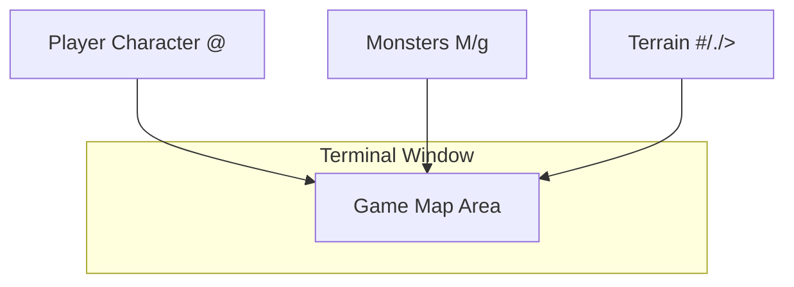
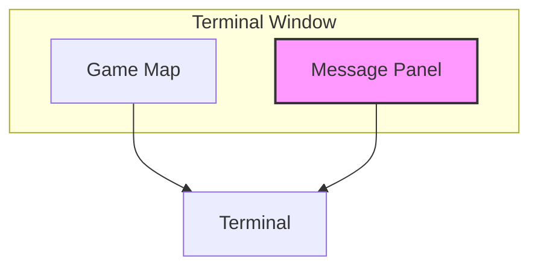
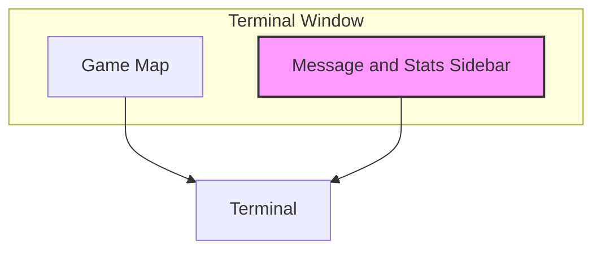
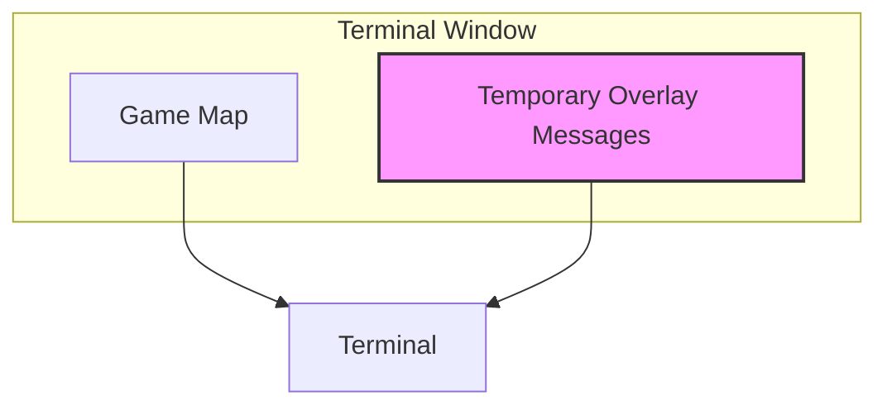
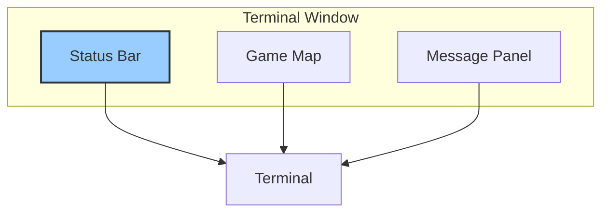
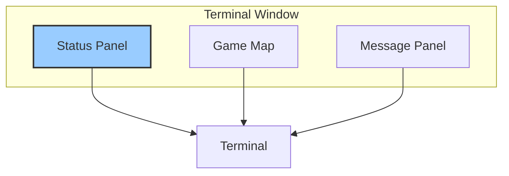
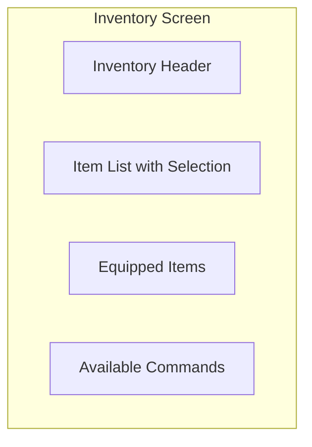
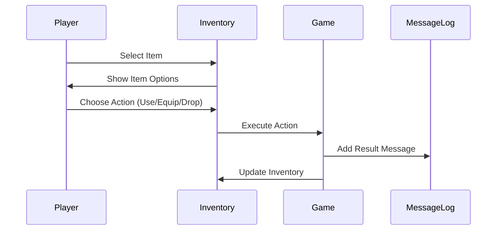
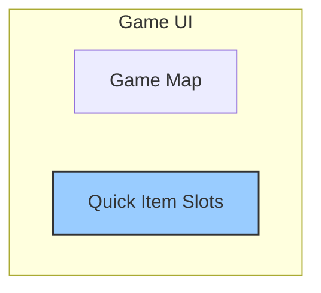
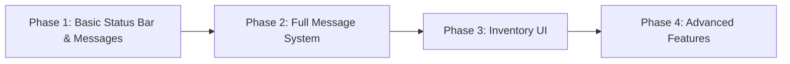

# Vanilla Roguelike: Visual Display Design

## Overview

This document analyzes the current visual display system of the Vanilla roguelike game and proposes improvements for a more comprehensive user interface. It covers the existing map rendering approach, suggests integration points for the message system, and outlines display options for player statistics and inventory.

## Table of Contents

1. [Current Map Display System](#current-map-display-system)
2. [Message System Integration](#message-system-integration)
3. [Player Information Display](#player-information-display)
4. [Inventory UI Design](#inventory-ui-design)
5. [Implementation Recommendations](#implementation-recommendations)

## Current Map Display System

### Terminal-Based Rendering

The Vanilla roguelike currently uses ASCII characters rendered in the terminal for its visual display. The game represents various elements using specific characters:

```
@ - Player character
# - Wall
. - Floor/Passage
> - Stairs down
M/m/g - Various monsters
~ - Water (if implemented)
^ - Trap (if implemented)
```

The game grid is rendered directly to the terminal with each cell represented by a single character. This approach is lightweight and consistent with traditional roguelike aesthetics.

### Map Generation Example

Below is an example of how a typical generated map might appear to the player:

```
###################################
#.....#.........#.................#
#.....#.........#.................#
#...................#.............#
#.....#..........M..#.............#
#######..........#####............#
#.....#..........#...#............#
#.....#.....@....#...#............#
#.....#..........#...#............#
#.....#..........#...#............#
#.....#..........#...#............#
#.....#..........#####............#
#.....#.........................g.#
#.....#.........................>.#
###################################
```

In this example:
- `@` represents the player character
- `#` represents walls
- `.` represents floors/passages
- `M` represents a monster (in this case, a more powerful one)
- `g` represents a goblin or similar weak monster
- `>` represents stairs to the next level

### Current Layout Structure

The display currently uses the entire terminal window with minimal organization of information:



### Current Limitations

1. **Limited Context**: Players have minimal information about their character stats, health, etc.
2. **No Message History**: Game events are not persistently displayed or recorded
3. **No Inventory View**: No dedicated UI for viewing or managing items
4. **Limited Visual Differentiation**: Elements are distinguished only by ASCII characters
5. **No Status Effects Display**: No way to show active effects on the player
6. **No Progression Indicators**: No display of level, experience, or similar metrics

## Message System Integration

The proposed message system (from the message_system_integration.md document) needs visual integration with the game UI. Below are three design options for displaying messages.

### Option 1: Bottom Message Panel



**Visual Layout**:
```
###################################
#.....#.........#.................#
#.....#.........#.................#
#...................#.............#
#.....#..........M..#.............#
#######..........#####............#
#.....#..........#...#............#
#.....#.....@....#...#............#
#.....#..........#...#............#
#.....#..........#...#............#
#.....#..........#...#............#
#.....#..........#####............#
#.....#.........................g.#
#.....#.........................>.#
###################################
-----------------------------------
You hit the goblin for 3 damage.
The monster moves closer to you.
You see stairs leading downward.
-----------------------------------
```

**Advantages**:
- Clear separation between game map and messages
- Familiar design pattern in roguelikes
- Simple to implement
- Preserves maximum map space

**Disadvantages**:
- Limited message history visible
- Reduces vertical space for map

### Option 2: Right Sidebar Messages



**Visual Layout**:
```
#########################|----------------------
#.....#.........#........|HP: 20/20  MP: 10/10
#.....#.........#........|Lvl: 1     XP: 0/100
#...................#....|----------------------
#.....#..........M..#....|MESSAGES:
#######..........#####...|You hit the goblin for
#.....#..........#...#...|3 damage.
#.....#.....@....#...#...|
#.....#..........#...#...|The monster moves
#.....#..........#...#...|closer to you.
#.....#..........#...#...|
#.....#..........#####...|You see stairs leading
#.....#.................g.|downward.
#.....#.................>.|
#########################|----------------------
```

**Advantages**:
- Can display more information (messages and stats)
- Preserves vertical map space
- Clear organization of different types of information

**Disadvantages**:
- Reduces horizontal map space
- May not work well on smaller terminal windows
- More complex layout management

### Option 3: Overlay Messages



**Visual Layout**:
```
###################################
#.....#.........#.................#
#.....#.........#.................#
#...................#.............#
#.....#..........M..#.............#
#######..........#####............#
#.....#..........#...#............#
#.....#.....@....#...#............#
#.....#..........#...#............#
#.....#..........#...#............#
+---------------------------+
| You hit the goblin for 3. |
+---------------------------+
#.....#..........#####............#
#.....#.........................g.#
#.....#.........................>.#
###################################
```

**Advantages**:
- No permanent screen space taken by messages
- Full map visibility most of the time
- Can be visually distinctive

**Disadvantages**:
- Temporarily obscures parts of the map
- No persistent message history visible
- More complex to implement

### Recommended Approach: Combined Bottom Panel and Toggle

A hybrid approach that uses a bottom message panel by default, but allows toggling to a full-screen message history:

```mermaid
graph TD
    subgraph Normal Mode
        GameMap1[Game Map]
        MessagePanel[Message Panel - 3-5 lines]
    end

    subgraph Message History Mode
        MessageHistory[Full Message History]
        ReturnPrompt[Return Prompt]
    end

    Toggle[Toggle Key 'M'] --> Normal Mode
    Toggle --> Message History Mode
```

**Implementation**:
- Display 3-5 recent messages in the bottom panel during normal gameplay
- When player presses 'M', switch to a full-screen message history view
- In message history view, allow scrolling through all messages
- Categorize messages by color (combat = red, items = yellow, etc.)
- Return to game with Escape key

## Player Information Display

Currently, the game lacks a dedicated area for displaying player statistics and status information. Below are proposals for implementing this crucial UI element.

### Top Status Bar



**Visual Layout**:
```
HP: 20/20 | MP: 10/10 | Lvl: 1 | Str: 10 | Dex: 8 | Int: 7 | Floor: 2
###################################
#.....#.........#.................#
#.....#.........#.................#
#...................#.............#
#.....#..........M..#.............#
#######..........#####............#
#.....#..........#...#............#
#.....#.....@....#...#............#
#.....#..........#...#............#
#.....#..........#...#............#
#.....#..........#...#............#
#.....#..........#####............#
#.....#.........................g.#
#.....#.........................>.#
###################################
You hit the goblin for 3 damage.
The monster moves closer to you.
```

**Key Information to Display**:

1. **Basic Stats**:
   - Health Points (HP): Current/Maximum
   - Mana Points (MP): Current/Maximum (if magic system is implemented)
   - Level and Experience: Level and XP progress

2. **Attributes**:
   - Strength: Affects damage, carrying capacity
   - Dexterity: Affects accuracy, dodge
   - Intelligence: Affects magic (if implemented)

3. **Game Progress**:
   - Current dungeon floor/level
   - Score (if applicable)

4. **Status Effects**:
   - Icons or abbreviated text for active effects (e.g., PSN for poisoned)

### Side Status Panel

For games with more complex character information, a side panel might be preferable:



**Visual Layout**:
```
CHARACTER---|###################################
HP: 20/20   |#.....#.........#.................#
MP: 10/10   |#.....#.........#.................#
------------|#...................#.............#
STR: 10     |#.....#..........M..#.............#
DEX: 8      |#######..........#####............#
INT: 7      |#.....#..........#...#............#
------------|#.....#.....@....#...#............#
LEVEL: 1    |#.....#..........#...#............#
XP: 45/100  |#.....#..........#...#............#
FLOOR: 2    |#.....#..........#...#............#
------------|#.....#..........#####............#
STATUS:     |#.....#.........................g.#
None        |#.....#.........................>.#
------------|###################################
            |You hit the goblin for 3 damage.
            |The monster moves closer to you.
```

**Recommended Approach**:

For the terminal-based ASCII interface, the top status bar is recommended as it:
1. Preserves maximum map viewing area
2. Keeps all critical information visible at a glance
3. Is simpler to implement
4. Works better on varying terminal sizes

## Inventory UI Design

The inventory system needs a dedicated UI that allows players to view, use, equip, and drop items.

### Full Screen Inventory

When the player triggers the inventory (typically with 'i' key), a full-screen inventory view replaces the map:



**Visual Layout**:
```
┌─────────────────── INVENTORY ───────────────────┐
│                                                 │
│ ITEMS:                           EQUIPPED:      │
│  a) Health Potion (x3)           Weapon: Dagger │
│  b) Scroll of Fireball           Armor: Leather │
│ >c) Iron Sword                   Head: None     │
│  d) Gold Coin (x15)              Hands: None    │
│  e) Leather Armor                Feet: None     │
│                                                 │
│                                                 │
│                                                 │
│                                                 │
│                                                 │
│                                                 │
│                                                 │
│ Commands: [e]quip, [u]se, [d]rop, [ESC] close   │
└─────────────────────────────────────────────────┘
```

**Key Features**:

1. **Item List**:
   - Alphabetical or numerical prefixes for selection
   - Item name and quantity (if stackable)
   - Selection cursor (>)
   - Optional color coding by item type or rarity

2. **Equipped Items**:
   - Display of all equipment slots
   - Currently equipped items
   - Empty slots shown as "None"

3. **Item Details**:
   - Description of currently selected item
   - Item stats if applicable

4. **Command Reference**:
   - Available commands for the current context
   - Key bindings

### Inventory Interactions

When an item is selected, the player should be able to:



**Action Menu Example**:
```
┌─────────────── IRON SWORD ───────────────────┐
│                                              │
│ Damage: 5-8                                  │
│ Weight: 3.0                                  │
│                                              │
│ A well-crafted sword made of iron.           │
│ Provides reliable damage against most foes.  │
│                                              │
│                                              │
│ Actions:                                     │
│ [e] Equip                                    │
│ [d] Drop                                     │
│ [ESC] Cancel                                 │
│                                              │
└──────────────────────────────────────────────┘
```

### Quick Access Inventory

For frequently used items, a quick access system can be implemented:



**Visual Implementation**:
```
HP: 20/20 | MP: 10/10 | Lvl: 1 | Floor: 2 | [1]Health Potion [2]Fireball
###################################
#.....#.........#.................#
#.....#.........#.................#
...
```

Players can assign items to number keys (1-9) for quick access during gameplay.

## Implementation Recommendations

### 1. Terminal UI Framework

To implement these UI improvements while maintaining the terminal-based approach, consider:

- Using a terminal manipulation library like `curses` or `blessed` for Ruby
- Implementing a simple UI component system with:
  - Base UI component class
  - Panel, Label, List, and Menu subclasses
  - Layout manager for arranging components

### 2. Phased Implementation Approach



1. **Phase 1**: Add a simple status bar at the top and message panel at the bottom
2. **Phase 2**: Implement full message history and categorization
3. **Phase 3**: Add inventory UI with basic functionality
4. **Phase 4**: Implement more advanced UI features (quick slots, detailed item info)

### 3. UI Configuration

Allow players to customize UI elements:
- Configurable colors for different elements
- Options to resize or hide certain panels
- Keybindings for UI navigation

### 4. Responsive Design

Make the UI responsive to different terminal sizes:
- Scale map area based on available space
- Prioritize critical information when space is limited
- Provide fallback layouts for very small terminals

## Conclusion

The proposed UI improvements build upon the classic ASCII roguelike foundation while enhancing player experience through better information display and interaction. By implementing these changes, the Vanilla roguelike will gain:

1. Better player feedback through the message system
2. Clearer game state visualization with the status display
3. Improved item management with the inventory system
4. More intuitive game interactions overall

These improvements maintain the traditional roguelike aesthetic while modernizing the user experience, making the game both more accessible to new players and more satisfying for experienced roguelike enthusiasts.